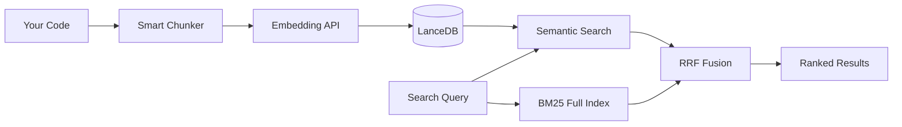

# FSS-Mini-RAG 

> **A lightweight, educational RAG system that actually works**
> *Distilled from 2 years of building production RAG systems. Designed to be understood, modified, and used.*

## Quick Start

```bash
git clone https://github.com/FSSCoding/Fss-Mini-Rag.git
cd Fss-Mini-Rag
python3 -m venv .venv
source .venv/bin/activate
pip install -r requirements.txt && pip install -e .
```

**Then start using it:**
```bash
rag-mini init                          # Index current directory
rag-mini search "authentication logic" # Search your codebase
```

**Windows:** Use `.venv\Scripts\activate.bat`, or run `install_windows.bat` for guided setup.

> Install time: 2-5 minutes. Dependencies total ~120MB.

## Demo


## Architecture


```mermaid
flowchart LR
    Files[Your Code] --> Chunker[Smart Chunker]
    Chunker --> Embedder[Embedding API]
    Embedder --> LanceDB[(LanceDB)]

    Query[Search Query] --> Semantic[Semantic Search]
    Query --> BM25[BM25 Full Index]
    LanceDB --> Semantic
    Semantic --> RRF[RRF Fusion]
    BM25 --> RRF
    RRF --> Results[Ranked Results]
```

**Dual-pipeline search**: Semantic and BM25 keyword search run independently against the full index, then merge via Reciprocal Rank Fusion. Keyword matches are found even when embeddings miss, and semantic matches are found even when keywords don't match exactly.

## Key Features

### Search
- **Independent semantic + BM25** with RRF fusion (no shortlist bottleneck)
- **Code-aware tokenizer** - splits `snake_case` and `CamelCase` for better keyword matching
- **Auto-calibrating score labels** - human-readable quality indicators (HIGH/GOOD/FAIR/LOW)
- **Result consolidation** - adjacent chunks from the same file merged into passages

### Chunking
- **Python**: AST-based extraction with module headers, inter-function code, and docstrings
- **Markdown**: Paragraph-based splitting with code block preservation and header hierarchy
- **Section boundaries preserved** - regulatory/compliance documents stay properly separated
- **File overview chunks** - one per file listing all functions/classes for "what's in this file" queries

### Embeddings
- **OpenAI-compatible endpoint** (works with LM Studio, vLLM, OpenAI, or any proxy)
- **Auto-detection** - queries `/v1/models` and selects the best embedding model
- **Two profiles**: `precision` (MiniLM, literal matching) or `conceptual` (Nomic, semantic depth)
- **No fake fallbacks** - if no provider is available, says so honestly (BM25 still works)

### Benchmarked

Tested with A/B comparison across 3 embedding models on 2 collections:

| Model | Dim | Index Speed | Precision | Profile |
|-------|-----|-------------|-----------|---------|
| MiniLM L6 v2 | 384 | 21 files/s | **100%** | precision (default) |
| Nomic v1.5 | 768 | 12 files/s | 90% | conceptual |
| Granite 107M | 384 | 17 files/s | 95% | precision |

Search time: ~15-20ms per query (warm). Cold start: ~600ms.

## Two Search Modes

### Synthesis Mode - Fast Answers
```bash
rag-mini search "authentication logic" --synthesize
```

### Exploration Mode - Deep Analysis
```bash
rag-mini explore ~/project
> How does authentication work in this codebase?
> What security concerns should I be aware of?
```

## Installation

### From Source (Recommended)
```bash
git clone https://github.com/FSSCoding/Fss-Mini-Rag.git
cd Fss-Mini-Rag
python3 -m venv .venv
source .venv/bin/activate
pip install -r requirements.txt
pip install -e .
```

### From PyPI (Coming Soon)
> `pip install fss-mini-rag` will be available once published.

### Optional: Embedding Server

FSS-Mini-RAG works with any OpenAI-compatible embedding endpoint. Recommended: [LM Studio](https://lmstudio.ai/) with the MiniLM L6 v2 embedding model loaded.

Without an embedding server, BM25 keyword search still works - you just don't get semantic similarity.

## System Requirements

- **Python 3.8+**
- **Embedding server** (LM Studio, Ollama, vLLM, or OpenAI) for semantic search
- Works on Linux, macOS, and Windows

## Configuration

Settings in `.mini-rag/config.yaml`:

```yaml
embedding:
  provider: openai          # openai, ollama, or ml
  base_url: http://localhost:1234/v1
  model: auto               # auto-detects best available
  profile: precision        # precision or conceptual

chunking:
  max_size: 2000            # characters per chunk
  min_size: 150

server:
  port: 7777

search:
  default_top_k: 10
  enable_bm25: true
```

## Documentation

- **[Getting Started](docs/GETTING_STARTED.md)** - First steps guide
- **[Technical Guide](docs/TECHNICAL_GUIDE.md)** - Architecture and internals
- **[Visual Diagrams](docs/DIAGRAMS.md)** - System flow charts
- **[TUI Guide](docs/TUI_GUIDE.md)** - Interactive interface walkthrough
- **[Troubleshooting](docs/TROUBLESHOOTING.md)** - Common issues and solutions
- **[Beginner Glossary](docs/BEGINNER_GLOSSARY.md)** - Plain-English terminology

## Project Philosophy

1. **Educational** - You can understand and modify every part
2. **Practical** - Actually finds relevant code, not just keyword matches
3. **Honest** - No fake fallbacks, clear error messages, benchmarked results
4. **Hackable** - Clean code, YAML config, Python API

## License

MIT - Use it, learn from it, build on it.

---

*Distilled from production RAG systems handling 14,000 queries/second. Built by someone who got frustrated with RAG implementations that were either too simple to be useful or too complex to understand.*
