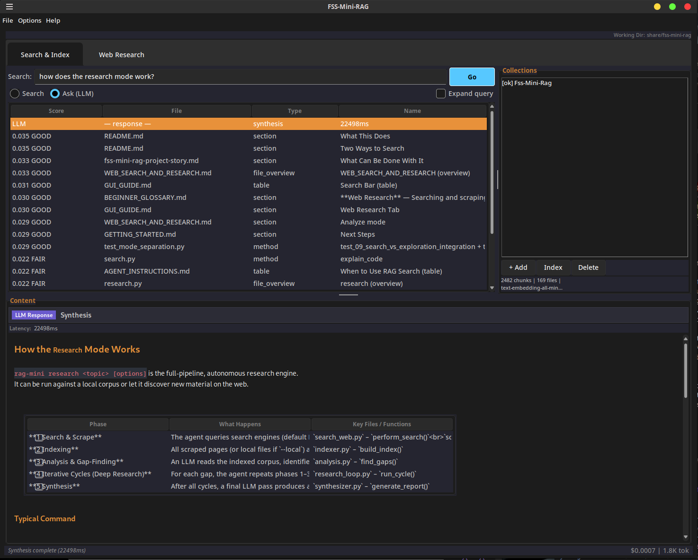
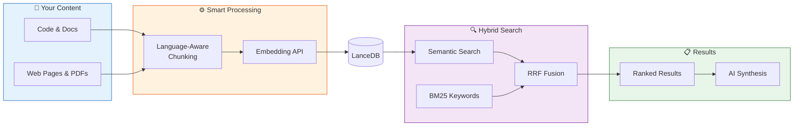
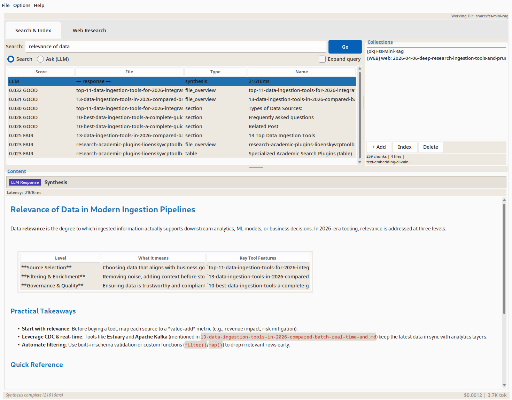
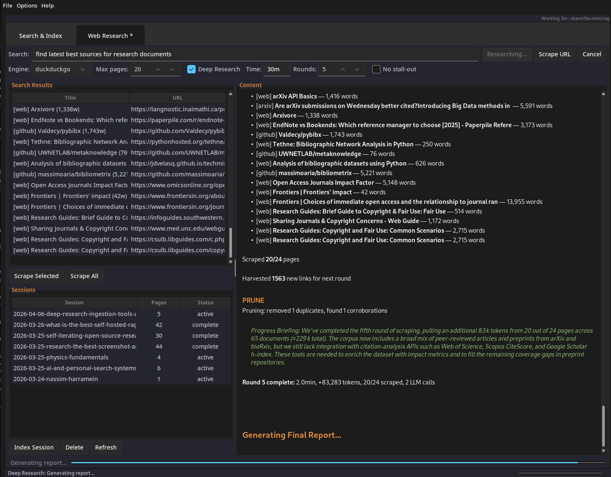

# FSS-Mini-RAG 

> **Search your code by meaning. Research any topic from the web. All running locally.**
> *Distilled from 2 years of building production RAG systems — designed to be understood, modified, and used.*


*Desktop GUI: semantic search with LLM synthesis, warm dark theme, rendered markdown output*

## What This Does

FSS-Mini-RAG is a self-contained research and code search system. Point it at a folder, a PDF, or a research topic — it indexes the content, searches by meaning (not just keywords), and gives you AI-synthesised answers from your own data.

**For developers:** Index a codebase, search for "how does authentication work" — finds login functions, session handlers, auth middleware across all files. Not just grep.

**For researchers:** Search the web for a topic, scrape the results, index locally, run deep research with iterative LLM analysis — build a knowledge base overnight.

**For anyone:** Desktop GUI, no terminal required. Works on a 6GB VRAM laptop. No cloud, no API keys needed (though they help).

---

## How It Works


```mermaid
flowchart LR
    subgraph Input["📁 Your Content"]
        Files[Code & Docs]
        Web[Web Pages & PDFs]
    end

    subgraph Process["⚙️ Smart Processing"]
        Chunk[Language-Aware\nChunking]
        Embed[Embedding API]
    end

    subgraph Search["🔍 Hybrid Search"]
        Semantic[Semantic Search]
        BM25[BM25 Keywords]
        RRF[RRF Fusion]
    end

    subgraph Output["📋 Results"]
        Ranked[Ranked Results]
        LLM[AI Synthesis]
    end

    Files --> Chunk --> Embed --> DB[(LanceDB)]
    Web --> Chunk
    DB --> Semantic --> RRF --> Ranked --> LLM
    BM25 --> RRF

    style Input fill:#e3f2fd,stroke:#1565c0
    style Process fill:#fff3e0,stroke:#e65100
    style Search fill:#f3e5f5,stroke:#7b1fa2
    style Output fill:#e8f5e9,stroke:#2e7d32
```

Semantic and BM25 keyword search run **independently** against the full index, then merge via Reciprocal Rank Fusion. Keyword matches are found even when embeddings miss. Semantic matches are found even when keywords don't match exactly.

---

## Download & Install

### Windows — No Python Needed
Download **`fss-mini-rag-setup.exe`** from [GitHub Releases](https://github.com/FSSCoding/Fss-Mini-Rag/releases/latest). Double-click to install. Includes Start Menu shortcuts and optional PATH integration.

### Linux — One Command
```bash
curl -fsSL https://raw.githubusercontent.com/FSSCoding/Fss-Mini-Rag/main/install.sh | bash
```
Or grab the **`.deb`** (Debian/Ubuntu) or **`.AppImage`** (any distro, single file) from [Releases](https://github.com/FSSCoding/Fss-Mini-Rag/releases/latest).

### From Source — All Platforms
```bash
git clone https://github.com/FSSCoding/Fss-Mini-Rag.git
cd Fss-Mini-Rag
python3 -m venv .venv && source .venv/bin/activate
pip install -r requirements.txt && pip install -e .
```
Windows: use `.venv\Scripts\activate.bat` or run `install_windows.bat` for guided setup.

---

## Quick Start

```bash
rag-mini init                              # Index current directory
rag-mini search "authentication logic"     # Search your codebase
rag-mini search "error handling" --synthesize  # Get an AI summary
rag-mini gui                               # Launch the desktop GUI
```

### Web Research
```bash
rag-mini scrape https://arxiv.org/abs/2405.07987 --index   # Scrape & index a paper
rag-mini search-web "quantum gravity" --engine brave        # Search the web
rag-mini research "proton structure" --deep --time 1h       # Deep research with time budget
```

---

## Two Ways to Search

### Fast Mode — Search + Synthesis
```bash
rag-mini search "how does the login system work" --synthesize
```
Finds relevant code across all files, then an LLM reads the results and gives you a plain-English summary. Fast, factual, one-shot.

### Deep Research — Iterative Analysis
```bash
rag-mini research "quantum vacuum fluctuations" --deep --time 2h
```
The engine autonomously searches the web, scrapes results, indexes content, has an LLM analyse the corpus for gaps, generates new queries, and repeats — building a comprehensive knowledge base over hours. Walk away and come back to a research report.

---

## Desktop GUI

Launch with `rag-mini gui`. Dark/light theme, two-tab layout:

**Search & Index** — Browse collections, search with live results, toggle LLM synthesis, view content with syntax highlighting.


*Light theme with LLM synthesis — rendered markdown with tables and formatted takeaways*

**Web Research** — Search the web, scrape URLs, run deep research sessions, manage your research corpus.


*Deep research session completing — 5 rounds of autonomous search, scrape, and analysis*

Built with Tkinter + Sun Valley theme. LLM responses stream live with collapsible thinking blocks.

---

## Key Features

| Category | What You Get |
|----------|-------------|
| **Search** | Independent semantic + BM25 with RRF fusion, code-aware tokenizer (`snake_case`/`CamelCase` splitting), auto-calibrating score labels, adjacent chunk consolidation |
| **Chunking** | Python AST extraction, paragraph-based markdown splitting, code block preservation, file overview chunks, per-language size tuning |
| **Embeddings** | Any OpenAI-compatible endpoint (LM Studio, vLLM, OpenAI), auto-detection via `/v1/models`, two profiles (precision/conceptual), honest degradation to BM25-only |
| **Web Research** | HTML/PDF/arXiv/GitHub extractors, DuckDuckGo/Serper/Tavily/Brave search, deep research with time budgets, vector-based corpus deduplication |
| **Desktop GUI** | Tkinter + Sun Valley dark/light theme, LLM streaming with live tokens, RenderedMarkdown widget, research session management |
| **Rate Limiting** | Built-in retry with exponential backoff for all API calls, per-domain tracking, robots.txt compliance |

### Benchmarked

| Model | Dim | Index Speed | Precision | Profile |
|-------|-----|-------------|-----------|---------|
| MiniLM L6 v2 | 384 | 21 files/s | **100%** | precision (default) |
| Nomic v1.5 | 768 | 12 files/s | 90% | conceptual |
| Granite 107M | 384 | 17 files/s | 95% | precision |

Search time: **~15-20ms** per query (warm). Cold start: ~600ms.

---

## All CLI Commands

```bash
# Core
rag-mini init [--path DIR] [--force]       # Index a project
rag-mini search "query" [--synthesize]     # Hybrid search (+ AI summary)
rag-mini status                            # Index health and system info
rag-mini gui                               # Desktop GUI

# Web Research
rag-mini scrape URL [--index] [--depth N]  # Scrape URLs to markdown
rag-mini search-web "query" [--engine X]   # Search the web
rag-mini research "topic" [--deep --time]  # Full research pipeline
rag-mini research --list                   # Manage sessions

# Utilities
rag-mini find-function "name"              # Find function by name
rag-mini find-class "ClassName"            # Find class by name
rag-mini watch                             # Auto-update on file changes
rag-mini update                            # Update index for changed files
rag-mini info                              # System info and capabilities
rag-mini server                            # REST API server
```

---

## Configuration

Settings live in `.mini-rag/config.yaml` (created on first run):

```yaml
embedding:
  provider: openai              # openai or ml
  base_url: http://localhost:1234/v1
  model: auto                   # auto-detects best available
  profile: precision            # precision or conceptual

chunking:
  max_size: 2000                # characters per chunk
  min_size: 150

search:
  default_top_k: 10
  enable_bm25: true
```

### Optional: Embedding Server

FSS-Mini-RAG works with any OpenAI-compatible endpoint. Recommended: [LM Studio](https://lmstudio.ai/) with MiniLM L6 v2 loaded.

Without an embedding server, BM25 keyword search still works — you just don't get semantic similarity.

---

## System Requirements

- **Python 3.8+** (or use the Windows standalone installer — no Python needed)
- **Embedding server** for semantic search (LM Studio, vLLM, or OpenAI)
- Works on **Linux, macOS, and Windows**
- Runs on **6GB VRAM** laptops (MiniLM embeddings + local LLM)

---

## Documentation

| Guide | What It Covers |
|-------|---------------|
| **[Getting Started](docs/GETTING_STARTED.md)** | First steps, installation, first search |
| **[Technical Guide](docs/TECHNICAL_GUIDE.md)** | Architecture, internals, all modules |
| **[Visual Diagrams](docs/DIAGRAMS.md)** | System flow charts and architecture layers |
| **[Web Search & Research](docs/WEB_SEARCH_AND_RESEARCH.md)** | Web scraping, deep research, session management |
| **[Hybrid Search Algorithm](docs/HYBRID_SEARCH_ALGORITHM.md)** | RRF fusion, BM25 tokenizer, re-ranking |
| **[Pruning & Organisation](docs/PRUNING_AND_ORGANISATION.md)** | Corpus deduplication and cross-referencing |
| **[LLM Providers](docs/LLM_PROVIDERS.md)** | Configure LM Studio, OpenAI, Anthropic, OpenRouter |
| **[Desktop GUI Guide](docs/GUI_GUIDE.md)** | GUI features, keyboard shortcuts, preferences |
| **[Troubleshooting](docs/TROUBLESHOOTING.md)** | Common issues and solutions |
| **[Beginner Glossary](docs/BEGINNER_GLOSSARY.md)** | RAG terminology in plain English |
| **[Project Story](docs/fss-mini-rag-project-story.md)** | Origins, the 6-month gap, the 3-day revival |

---

## Philosophy

1. **Practical** — Actually finds relevant code, not just keyword matches
2. **Honest** — No fake fallbacks, clear errors, benchmarked results
3. **Self-contained** — Search, scrape, index, and query from one tool
4. **Hackable** — Clean code, YAML config, Python API — understand and modify every part

## License

MIT — Use it, learn from it, build on it.

---

*Distilled from production RAG systems handling 20-35 queries/second across 38,000+ chunks. Built for researchers, developers, and anyone with files and questions.*
