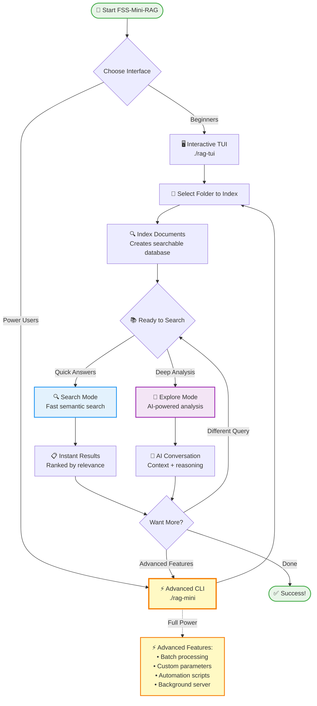
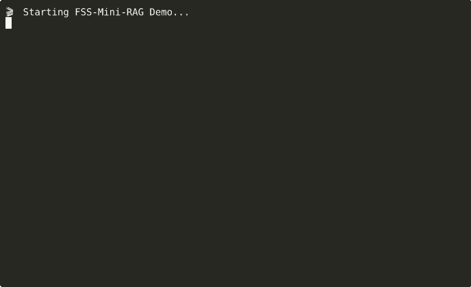

# FSS-Mini-RAG 

> **A lightweight, educational RAG system that actually works**  
> *Built for beginners who want results, and developers who want to understand how RAG really works*

## 🚀 **Quick Start**

```bash
git clone https://github.com/FSSCoding/Fss-Mini-Rag.git
cd Fss-Mini-Rag
python3 -m venv .venv
source .venv/bin/activate
pip install -r requirements.txt && pip install -e .
```

**Then start using it:**
```bash
rag-mini init                          # Index current directory
rag-mini search "authentication logic" # Search your codebase
```

**Windows:** Use `python -m venv .venv` and `.venv\Scripts\activate.bat`, or run `install_windows.bat` for guided setup.

> **Install time:** 2-5 minutes depending on internet speed. Dependencies total ~120MB.

## Demo


*See it in action: index a project and search semantically in seconds*

## How It Works


```mermaid
flowchart TD
    Start([🚀 Start FSS-Mini-RAG]) --> Interface{Choose Interface}
    
    Interface -->|Beginners| TUI[🖥️ Interactive TUI<br/>./rag-tui]
    Interface -->|Power Users| CLI[⚡ Advanced CLI<br/>./rag-mini <command>]
    
    TUI --> SelectFolder[📁 Select Folder to Index]
    CLI --> SelectFolder
    
    SelectFolder --> Index[🔍 Index Documents<br/>Creates searchable database]
    
    Index --> Ready{📚 Ready to Search}
    
    Ready -->|Quick Answers| Search[🔍 Search Mode<br/>Fast semantic search]
    Ready -->|Deep Analysis| Explore[🧠 Explore Mode<br/>AI-powered analysis]
    
    Search --> SearchResults[📋 Instant Results<br/>Ranked by relevance]
    Explore --> ExploreResults[💬 AI Conversation<br/>Context + reasoning]
    
    SearchResults --> More{Want More?}
    ExploreResults --> More
    
    More -->|Different Query| Ready
    More -->|Advanced Features| CLI
    More -->|Done| End([✅ Success!])
    
    CLI -.->|Full Power| AdvancedFeatures[⚡ Advanced Features:<br/>• Batch processing<br/>• Custom parameters<br/>• Automation scripts<br/>• Background server]
    
    style Start fill:#e8f5e8,stroke:#4caf50,stroke-width:2px
    style CLI fill:#fff9c4,stroke:#f57c00,stroke-width:3px
    style AdvancedFeatures fill:#fff9c4,stroke:#f57c00,stroke-width:2px
    style Search fill:#e3f2fd,stroke:#2196f3,stroke-width:2px
    style Explore fill:#f3e5f5,stroke:#9c27b0,stroke-width:2px
    style End fill:#e8f5e8,stroke:#4caf50,stroke-width:2px
```

## What This Is

FSS-Mini-RAG is a distilled, lightweight implementation of a production-quality RAG (Retrieval Augmented Generation) search system. Born from 2 years of building, refining, and tuning RAG systems - from enterprise-scale solutions handling 14,000 queries/second to lightweight implementations that anyone can install and understand.

**The Problem This Solves**: Most RAG implementations are either too simple (poor results) or too complex (impossible to understand and modify). This bridges that gap.

## Two Powerful Modes

FSS-Mini-RAG offers **two distinct experiences** optimized for different use cases:

### 🚀 **Synthesis Mode** - Fast & Consistent
```bash
./rag-mini search ~/project "authentication logic" --synthesize
```
- **Perfect for**: Quick answers, code discovery, fast lookups
- **Speed**: Lightning fast responses (no thinking overhead)
- **Quality**: Consistent, reliable results

### 🧠 **Exploration Mode** - Deep & Interactive  
```bash
./rag-mini explore ~/project
> How does authentication work in this codebase?
> Why is the login function slow?
> What security concerns should I be aware of?
```
- **Perfect for**: Learning codebases, debugging, detailed analysis
- **Features**: Thinking-enabled LLM, conversation memory, follow-up questions
- **Quality**: Deep reasoning with full context awareness

## Quick Start (2-10 Minutes)

> **⏱️ Installation Time**: Typical install takes 2-3 minutes with fast internet, up to 5-10 minutes on slower connections due to large dependencies (LanceDB 36MB, PyArrow 43MB, PyLance 44MB).

**Step 1: Install**
```bash
# Clone the repository
git clone https://github.com/FSSCoding/Fss-Mini-Rag.git
cd Fss-Mini-Rag

# Install dependencies and package
python3 -m venv .venv

# CRITICAL: Use full path activation for reliability
.venv/bin/python -m pip install -r requirements.txt  # 1-8 minutes (depends on connection)
.venv/bin/python -m pip install .                    # ~1 minute

# Activate environment for using the command
source .venv/bin/activate    # Linux/macOS
# .venv\Scripts\activate     # Windows
```

**If you get "externally-managed-environment" error:**
```bash
# Use direct path method (bypasses system restrictions entirely)
.venv/bin/python -m pip install -r requirements.txt --break-system-packages
.venv/bin/python -m pip install . --break-system-packages

# Then activate for using the command
source .venv/bin/activate
```

**Step 2: Create an Index & Start Using**
```bash
# Navigate to any project and create an index
cd ~/my-project
rag-mini init                # Create index for current directory
# OR: rag-mini init -p /path/to/project  (specify path)

# Now search your codebase
rag-mini search "authentication logic"
rag-mini search "how does login work"

# Or use the interactive interface (from installation directory)  
./rag-tui                    # Interactive TUI interface
```

> **💡 Global Command**: After installation, `rag-mini` works from anywhere. It includes intelligent path detection to find nearby indexes and guide you to the right location.

That's it. No external dependencies, no configuration required, no PhD in computer science needed.

## What Makes This Different

### For Beginners
- **Just works** - Zero configuration required
- **Multiple interfaces** - TUI for learning, CLI for speed
- **Educational** - Shows you CLI commands as you use the TUI
- **Solid results** - Finds code by meaning, not just keywords

### For Developers
- **Hackable** - Clean, documented code you can actually modify
- **Configurable** - YAML config for everything, or change the code directly
- **Multiple embedding options** - Ollama, ML models, or hash-based
- **Production patterns** - Streaming, batching, error handling, monitoring

### For Learning
- **Complete technical documentation** - How chunking, embedding, and search actually work
- **Educational tests** - See the system in action with real examples
- **No magic** - Every decision explained, every component documented

## Usage Examples

### Find Code by Concept
```bash
./rag-mini search ~/project "user authentication"
# Finds: login functions, auth middleware, session handling, password validation
```

### Natural Language Queries  
```bash
./rag-mini search ~/project "error handling for database connections"
# Finds: try/catch blocks, connection pool error handlers, retry logic
```

### Development Workflow
```bash
./rag-mini index ~/new-project              # Index once
./rag-mini search ~/new-project "API endpoints"   # Search as needed
./rag-mini status ~/new-project            # Check index health
```



*Advanced usage: semantic search with synthesis and exploration modes*

## Installation Options

### 🎯 From Source (Recommended)

```bash
git clone https://github.com/FSSCoding/Fss-Mini-Rag.git
cd Fss-Mini-Rag
python3 -m venv .venv
source .venv/bin/activate          # Windows: .venv\Scripts\activate.bat
pip install -r requirements.txt
pip install -e .
```

### 📦 From PyPI (Coming Soon)

> Package manager install (`pip install fss-mini-rag`) will be available once published to PyPI. See [Issue #10](https://gitea.bobai.com.au/BobAi/Fss-Rag-Mini/issues/10) for status.

### 🖥️ Windows Interactive Installer

```cmd
install_windows.bat
```

Guided setup with prompts, virtual environment creation, and dependency installation.

### Optional: Install Ollama for Best Search Quality

Ollama provides high-quality semantic embeddings. Without it, FSS-Mini-RAG falls back to hash-based embeddings (still works, just less accurate).

```bash
curl -fsSL https://ollama.com/install.sh | sh
ollama pull nomic-embed-text
```


## System Requirements

- **Python 3.8+**
- **Optional: Ollama** (for best search quality - without it, uses hash-based embeddings)
- Works on Linux, macOS, and Windows

## Project Philosophy

This implementation prioritizes:

1. **Educational Value** - You can understand and modify every part
2. **Practical Results** - Actually finds relevant code, not just keyword matches  
3. **Zero Friction** - Works out of the box, configurable when needed
4. **Real-world Patterns** - Production techniques in beginner-friendly code

## What's Inside

- **Hybrid embedding system** - Ollama → ML → Hash fallbacks
- **Smart chunking** - Language-aware code parsing 
- **Vector + keyword search** - Best of both worlds
- **Streaming architecture** - Handles large codebases efficiently
- **Multiple interfaces** - TUI, CLI, Python API, server mode

## Next Steps

- **New users**: Run `./rag-tui` (Linux/macOS) or `rag.bat` (Windows) for guided experience
- **Developers**: Read [`TECHNICAL_GUIDE.md`](docs/TECHNICAL_GUIDE.md) for implementation details
- **Contributors**: Clone the repo and run `make dev-install` for development setup

## Documentation

- **[Getting Started](docs/GETTING_STARTED.md)** - Get running in 5 minutes
- **[Visual Diagrams](docs/DIAGRAMS.md)** - 📊 System flow charts and architecture diagrams
- **[TUI Guide](docs/TUI_GUIDE.md)** - Complete walkthrough of the friendly interface  
- **[Technical Guide](docs/TECHNICAL_GUIDE.md)** - How the system actually works
- **[Troubleshooting](docs/TROUBLESHOOTING.md)** - Fix common issues
- **[Beginner Glossary](docs/BEGINNER_GLOSSARY.md)** - Friendly terms and concepts

## License

MIT - Use it, learn from it, build on it.

---

*Built by someone who got frustrated with RAG implementations that were either too simple to be useful or too complex to understand. This is the system I wish I'd found when I started.*