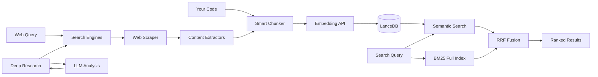

# FSS-Mini-RAG 

> **A lightweight, self-contained research and code search system**
> *Distilled from 2 years of building production RAG systems. Designed to be understood, modified, and used.*

## Download & Install

### Windows (no Python needed)
Download `fss-mini-rag-setup.exe` from [GitHub Releases](https://github.com/FSSCoding/Fss-Mini-Rag/releases/latest). Double-click to install.

### Linux (one-line install)
```bash
curl -fsSL https://raw.githubusercontent.com/FSSCoding/Fss-Mini-Rag/main/install.sh | bash
```

Or download the `.deb` (Debian/Ubuntu) or `.AppImage` (any distro) from [GitHub Releases](https://github.com/FSSCoding/Fss-Mini-Rag/releases/latest).

### From Source (all platforms)
```bash
git clone https://github.com/FSSCoding/Fss-Mini-Rag.git
cd Fss-Mini-Rag
python3 -m venv .venv
source .venv/bin/activate
pip install -r requirements.txt && pip install -e .
```

**Windows from source:** Use `.venv\Scripts\activate.bat`, or run `install_windows.bat` for guided setup.

## Quick Start

```bash
rag-mini init                          # Index current directory
rag-mini search "authentication logic" # Search your codebase
rag-mini gui                           # Launch desktop GUI
```

## Demo


## Architecture


```mermaid
flowchart LR
    Files[Your Code] --> Chunker[Smart Chunker]
    Chunker --> Embedder[Embedding API]
    Embedder --> LanceDB[(LanceDB)]

    Query[Search Query] --> Semantic[Semantic Search]
    Query --> BM25[BM25 Full Index]
    LanceDB --> Semantic
    Semantic --> RRF[RRF Fusion]
    BM25 --> RRF
    RRF --> Results[Ranked Results]

    WebQuery[Web Query] --> Engines[Search Engines]
    Engines --> Scraper[Web Scraper]
    Scraper --> Extractors[Content Extractors]
    Extractors --> Chunker

    Research[Deep Research] --> Engines
    Research --> LLM[LLM Analysis]
    LLM --> Research
```

**Dual-pipeline search**: Semantic and BM25 keyword search run independently against the full index, then merge via Reciprocal Rank Fusion. Keyword matches are found even when embeddings miss, and semantic matches are found even when keywords don't match exactly.

**Web research pipeline**: Search the web, scrape pages, extract clean content, index locally, and query with AI — all from the CLI or desktop GUI.

## Key Features

### Search
- **Independent semantic + BM25** with RRF fusion (no shortlist bottleneck)
- **Code-aware tokenizer** — splits `snake_case` and `CamelCase` for better keyword matching
- **Auto-calibrating score labels** — human-readable quality indicators (HIGH/GOOD/FAIR/LOW)
- **Result consolidation** — adjacent chunks from the same file merged into passages

### Chunking
- **Python**: AST-based extraction with module headers, inter-function code, and docstrings
- **Markdown**: Paragraph-based splitting with code block preservation and header hierarchy
- **Section boundaries preserved** — regulatory/compliance documents stay properly separated
- **File overview chunks** — one per file listing all functions/classes for "what's in this file" queries

### Embeddings
- **OpenAI-compatible endpoint** (works with LM Studio, vLLM, OpenAI, or any proxy)
- **Auto-detection** — queries `/v1/models` and selects the best embedding model
- **Two profiles**: `precision` (MiniLM, literal matching) or `conceptual` (Nomic, semantic depth)
- **No fake fallbacks** — if no provider is available, says so honestly (BM25 still works)

### Web Research
- **Web scraping** — fetch URLs and extract clean markdown from HTML, PDF, arXiv, GitHub
- **Search engines** — DuckDuckGo, Tavily, and Brave with unified interface
- **Deep research** — iterative ANALYZE→SEARCH→SCRAPE→PRUNE→REPORT cycles with time budgets
- **Rate limiting** — built-in retry infrastructure with backoff for all API calls

### Desktop GUI
- **Tkinter with Sun Valley theme** — dark/light mode toggle
- **Two-tab layout**: Search & Index + Web Research
- **LLM streaming** with live token rendering and collapsible thinking blocks
- **RenderedMarkdown widget** — rich text with syntax-highlighted code blocks, tables, clickable links

### Benchmarked

Tested with A/B comparison across 3 embedding models on 2 collections:

| Model | Dim | Index Speed | Precision | Profile |
|-------|-----|-------------|-----------|---------|
| MiniLM L6 v2 | 384 | 21 files/s | **100%** | precision (default) |
| Nomic v1.5 | 768 | 12 files/s | 90% | conceptual |
| Granite 107M | 384 | 17 files/s | 95% | precision |

Search time: ~15-20ms per query (warm). Cold start: ~600ms.

## CLI Commands

### Core
```bash
rag-mini init                              # Index current directory
rag-mini init --path ~/project --force     # Force re-index a specific path
rag-mini search "query"                    # Search indexed codebase
rag-mini search "query" --synthesize       # Search with LLM synthesis
rag-mini status                            # System status and index health
rag-mini gui                               # Launch desktop GUI
```

### Web Research
```bash
rag-mini scrape https://example.com        # Scrape URL to clean markdown
rag-mini scrape https://arxiv.org/abs/... --index  # Scrape and auto-index
rag-mini search-web "topic" --engine brave # Search the web
rag-mini research "topic" --engine tavily  # Search → scrape → index pipeline
rag-mini research "topic" --deep --time 1h # Deep research with iterative cycles
```

### Utilities
```bash
rag-mini find-function "func_name"         # Find function by name
rag-mini find-class "ClassName"            # Find class by name
rag-mini watch                             # Auto-update index on file changes
rag-mini update                            # Update index for changed files
rag-mini info                              # Show system info and capabilities
rag-mini server                            # Start REST API server
```

## Installation

### From Source (Recommended)
```bash
git clone https://github.com/FSSCoding/Fss-Mini-Rag.git
cd Fss-Mini-Rag
python3 -m venv .venv
source .venv/bin/activate
pip install -r requirements.txt
pip install -e .
```

### From PyPI (Coming Soon)
> `pip install fss-mini-rag` will be available once published.

### Optional: Embedding Server

FSS-Mini-RAG works with any OpenAI-compatible embedding endpoint. Recommended: [LM Studio](https://lmstudio.ai/) with the MiniLM L6 v2 embedding model loaded.

Without an embedding server, BM25 keyword search still works — you just don't get semantic similarity.

## System Requirements

- **Python 3.8+**
- **Embedding server** (LM Studio, vLLM, or OpenAI) for semantic search
- Works on Linux, macOS, and Windows
- Runs on 6GB VRAM laptops (MiniLM embeddings + local LLM)

## Configuration

Settings in `.mini-rag/config.yaml`:

```yaml
embedding:
  provider: openai          # openai or ml
  base_url: http://localhost:1234/v1
  model: auto               # auto-detects best available
  profile: precision        # precision or conceptual

chunking:
  max_size: 2000            # characters per chunk
  min_size: 150

server:
  port: 7777

search:
  default_top_k: 10
  enable_bm25: true
```

## Documentation

- **[Getting Started](docs/GETTING_STARTED.md)** — First steps guide
- **[Technical Guide](docs/TECHNICAL_GUIDE.md)** — Architecture and internals
- **[Visual Diagrams](docs/DIAGRAMS.md)** — System flow charts
- **[Web Search & Research](docs/WEB_SEARCH_AND_RESEARCH.md)** — Web scraping and deep research
- **[Hybrid Search Algorithm](docs/HYBRID_SEARCH_ALGORITHM.md)** — RRF fusion details
- **[Pruning & Organisation](docs/PRUNING_AND_ORGANISATION.md)** — How the research engine deduplicates and cross-references
- **[LLM Providers](docs/LLM_PROVIDERS.md)** — Configure different AI providers
- **[Troubleshooting](docs/TROUBLESHOOTING.md)** — Common issues and solutions
- **[Beginner Glossary](docs/BEGINNER_GLOSSARY.md)** — Plain-English terminology
- **[Project Story](docs/fss-mini-rag-project-story.md)** — How this project came to be

## Project Philosophy

1. **Educational** — You can understand and modify every part
2. **Practical** — Actually finds relevant code, not just keyword matches
3. **Honest** — No fake fallbacks, clear error messages, benchmarked results
4. **Self-contained** — Search, scrape, index, and query from one tool

## License

MIT — Use it, learn from it, build on it.

---

*Distilled from production RAG systems handling 20-35 queries/second across 38,000+ chunks. Built for researchers, developers, and anyone with files, questions, and maybe an embedding server.*
