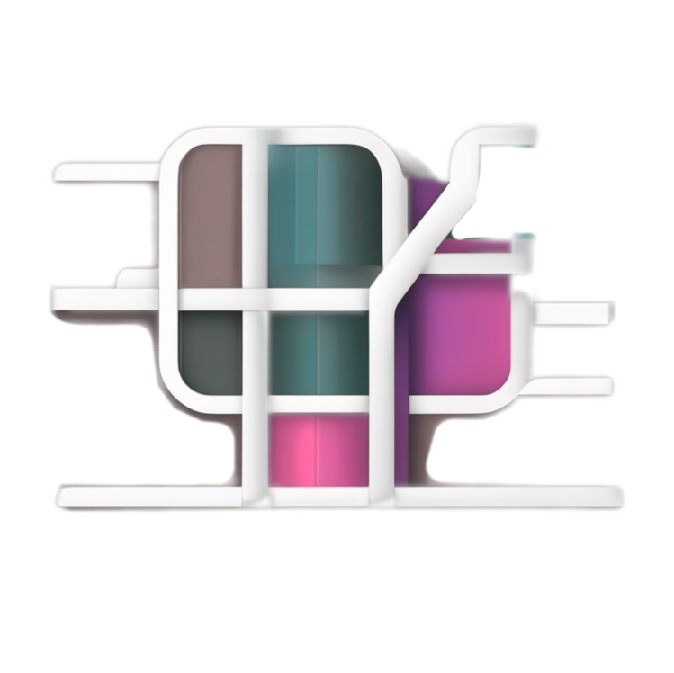

# FSS-Mini-RAG 

> **A lightweight, educational RAG system that actually works**  
> *Built for beginners who want results, and developers who want to understand how RAG really works*

## Demo


*See it in action: index a project and search semantically in seconds*

## How It Works


## What This Is

FSS-Mini-RAG is a distilled, lightweight implementation of a production-quality RAG (Retrieval Augmented Generation) search system. Born from 2 years of building, refining, and tuning RAG systems - from enterprise-scale solutions handling 14,000 queries/second to lightweight implementations that anyone can install and understand.

**The Problem This Solves**: Most RAG implementations are either too simple (poor results) or too complex (impossible to understand and modify). This bridges that gap.

## Two Powerful Modes

FSS-Mini-RAG offers **two distinct experiences** optimized for different use cases:

### 🚀 **Synthesis Mode** - Fast & Consistent
```bash
./rag-mini search ~/project "authentication logic" --synthesize
```
- **Perfect for**: Quick answers, code discovery, fast lookups
- **Speed**: Lightning fast responses (no thinking overhead)
- **Quality**: Consistent, reliable results

### 🧠 **Exploration Mode** - Deep & Interactive  
```bash
./rag-mini explore ~/project
> How does authentication work in this codebase?
> Why is the login function slow?
> What security concerns should I be aware of?
```
- **Perfect for**: Learning codebases, debugging, detailed analysis
- **Features**: Thinking-enabled LLM, conversation memory, follow-up questions
- **Quality**: Deep reasoning with full context awareness

## Quick Start (2 Minutes)

**Step 1: Install**
```bash
# Clone the repository
git clone https://github.com/FSSCoding/Fss-Mini-Rag.git
cd Fss-Mini-Rag

# Install dependencies and package
python3 -m venv .venv

# CRITICAL: Use full path activation for reliability
.venv/bin/python -m pip install -r requirements.txt
.venv/bin/python -m pip install .

# Activate environment for using the command
source .venv/bin/activate    # Linux/macOS
# .venv\Scripts\activate     # Windows
```

**If you get "externally-managed-environment" error:**
```bash
# Use direct path method (bypasses system restrictions entirely)
.venv/bin/python -m pip install -r requirements.txt --break-system-packages
.venv/bin/python -m pip install . --break-system-packages

# Then activate for using the command
source .venv/bin/activate
```

**Step 2: Start Using**
```bash
# Navigate to any project and search
cd ~/my-project
rag-mini init .              # Index current project
rag-mini search . "authentication logic"

# Or use the legacy interface
./rag-tui                    # Interactive interface
```

That's it. No external dependencies, no configuration required, no PhD in computer science needed.

## What Makes This Different

### For Beginners
- **Just works** - Zero configuration required
- **Multiple interfaces** - TUI for learning, CLI for speed
- **Educational** - Shows you CLI commands as you use the TUI
- **Solid results** - Finds code by meaning, not just keywords

### For Developers
- **Hackable** - Clean, documented code you can actually modify
- **Configurable** - YAML config for everything, or change the code directly
- **Multiple embedding options** - Ollama, ML models, or hash-based
- **Production patterns** - Streaming, batching, error handling, monitoring

### For Learning
- **Complete technical documentation** - How chunking, embedding, and search actually work
- **Educational tests** - See the system in action with real examples
- **No magic** - Every decision explained, every component documented

## Usage Examples

### Find Code by Concept
```bash
./rag-mini search ~/project "user authentication"
# Finds: login functions, auth middleware, session handling, password validation
```

### Natural Language Queries  
```bash
./rag-mini search ~/project "error handling for database connections"
# Finds: try/catch blocks, connection pool error handlers, retry logic
```

### Development Workflow
```bash
./rag-mini index ~/new-project              # Index once
./rag-mini search ~/new-project "API endpoints"   # Search as needed
./rag-mini status ~/new-project            # Check index health
```


*Advanced usage: semantic search with synthesis and exploration modes*

## Installation Options

### 🎯 Copy & Paste Installation (Guaranteed to Work) 

Perfect for beginners - these commands work on any fresh Ubuntu, Windows, or Mac system:

**Fresh Ubuntu/Debian System:**
```bash
# Install required system packages
sudo apt update && sudo apt install -y python3 python3-pip python3-venv git curl

# Clone and setup FSS-Mini-RAG
git clone https://github.com/FSSCoding/Fss-Mini-Rag.git
cd Fss-Mini-Rag

# Create isolated Python environment
python3 -m venv .venv
source .venv/bin/activate

# Install Python dependencies
pip install -r requirements.txt

# Optional: Install Ollama for best search quality (secure method)
curl -fsSL https://ollama.com/install.sh -o /tmp/ollama-install.sh
# Verify it's a shell script (basic safety check)
file /tmp/ollama-install.sh | grep -q "shell script" && chmod +x /tmp/ollama-install.sh && /tmp/ollama-install.sh
rm -f /tmp/ollama-install.sh
ollama serve &
sleep 3
ollama pull nomic-embed-text

# Ready to use!
./rag-mini index /path/to/your/project
./rag-mini search /path/to/your/project "your search query"
```

**Fresh CentOS/RHEL/Fedora System:**
```bash
# Install required system packages
sudo dnf install -y python3 python3-pip python3-venv git curl

# Clone and setup FSS-Mini-RAG
git clone https://github.com/FSSCoding/Fss-Mini-Rag.git
cd Fss-Mini-Rag

# Create isolated Python environment  
python3 -m venv .venv
source .venv/bin/activate

# Install Python dependencies
pip install -r requirements.txt

# Optional: Install Ollama for best search quality (secure method)
curl -fsSL https://ollama.com/install.sh -o /tmp/ollama-install.sh
# Verify it's a shell script (basic safety check)
file /tmp/ollama-install.sh | grep -q "shell script" && chmod +x /tmp/ollama-install.sh && /tmp/ollama-install.sh
rm -f /tmp/ollama-install.sh
ollama serve &
sleep 3
ollama pull nomic-embed-text

# Ready to use!
./rag-mini index /path/to/your/project
./rag-mini search /path/to/your/project "your search query"
```

**Fresh macOS System:**
```bash
# Install Homebrew (if not installed)
/bin/bash -c "$(curl -fsSL https://raw.githubusercontent.com/Homebrew/install/HEAD/install.sh)"

# Install required packages
brew install python3 git curl

# Clone and setup FSS-Mini-RAG
git clone https://github.com/FSSCoding/Fss-Mini-Rag.git
cd Fss-Mini-Rag

# Create isolated Python environment
python3 -m venv .venv
source .venv/bin/activate

# Install Python dependencies
pip install -r requirements.txt

# Optional: Install Ollama for best search quality (secure method)
curl -fsSL https://ollama.com/install.sh -o /tmp/ollama-install.sh
# Verify it's a shell script (basic safety check)
file /tmp/ollama-install.sh | grep -q "shell script" && chmod +x /tmp/ollama-install.sh && /tmp/ollama-install.sh
rm -f /tmp/ollama-install.sh
ollama serve &
sleep 3
ollama pull nomic-embed-text

# Ready to use!
./rag-mini index /path/to/your/project  
./rag-mini search /path/to/your/project "your search query"
```

**Fresh Windows System:**
```cmd
REM Install Python (if not installed)
REM Download from: https://python.org/downloads (ensure "Add to PATH" is checked)
REM Install Git from: https://git-scm.com/download/win

REM Clone and setup FSS-Mini-RAG
git clone https://github.com/FSSCoding/Fss-Mini-Rag.git
cd Fss-Mini-Rag

REM Create isolated Python environment
python -m venv .venv
.venv\Scripts\activate.bat

REM Install Python dependencies  
pip install -r requirements.txt

REM Optional: Install Ollama for best search quality
REM Download from: https://ollama.com/download
REM Run installer, then:
ollama serve
REM In new terminal:
ollama pull nomic-embed-text

REM Ready to use!
rag.bat index C:\path\to\your\project
rag.bat search C:\path\to\your\project "your search query"
```

**What these commands do:**
- **System packages**: Install Python 3.8+, pip (package manager), venv (virtual environments), git (version control), curl (downloads)
- **Clone repository**: Download FSS-Mini-RAG source code to your computer
- **Virtual environment**: Create isolated Python space (prevents conflicts with system Python)
- **Dependencies**: Install required Python libraries (pandas, numpy, lancedb, etc.)  
- **Ollama (optional)**: AI model server for best search quality - works offline and free
- **Model download**: Get high-quality embedding model for semantic search
- **Ready to use**: Index any folder and search through it semantically

### ⚡ For Agents & CI/CD: Headless Installation

Perfect for automated deployments, agents, and CI/CD pipelines:

**Linux/macOS:**
```bash
./install_mini_rag.sh --headless
# Automated installation with sensible defaults
# No interactive prompts, perfect for scripts
```

**Windows:**
```cmd
install_windows.bat --headless
# Automated installation with sensible defaults  
# No interactive prompts, perfect for scripts
```

**What headless mode does:**
- Uses existing virtual environment if available
- Installs core dependencies only (light mode)
- Downloads embedding model if Ollama is available
- Skips interactive prompts and tests
- Perfect for agent automation and CI/CD pipelines

### 🚀 Recommended: Full Installation

**Linux/macOS:**
```bash
./install_mini_rag.sh
# Handles Python setup, dependencies, optional AI models
```

**Windows:**
```cmd
install_windows.bat
# Handles Python setup, dependencies, works reliably
```

### Manual Setup

**Linux/macOS:**
```bash
python3 -m venv .venv
source .venv/bin/activate
pip install -r requirements.txt
```

**Windows:**
```cmd
python -m venv .venv
.venv\Scripts\activate.bat
pip install -r requirements.txt
```

**Note**: The experimental copy & run feature is provided for convenience but may fail on some systems. If you encounter issues, use the full installer for reliable setup.

## System Requirements

- **Python 3.8+** (installer checks and guides setup)
- **Optional: Ollama** (for best search quality - installer helps set up)
- **Fallback: Works without external dependencies** (uses built-in embeddings)

## Project Philosophy

This implementation prioritizes:

1. **Educational Value** - You can understand and modify every part
2. **Practical Results** - Actually finds relevant code, not just keyword matches  
3. **Zero Friction** - Works out of the box, configurable when needed
4. **Real-world Patterns** - Production techniques in beginner-friendly code

## What's Inside

- **Hybrid embedding system** - Ollama → ML → Hash fallbacks
- **Smart chunking** - Language-aware code parsing 
- **Vector + keyword search** - Best of both worlds
- **Streaming architecture** - Handles large codebases efficiently
- **Multiple interfaces** - TUI, CLI, Python API, server mode

## Next Steps

- **New users**: Run `./rag-tui` (Linux/macOS) or `rag.bat` (Windows) for guided experience
- **Developers**: Read [`TECHNICAL_GUIDE.md`](docs/TECHNICAL_GUIDE.md) for implementation details
- **Contributors**: See [`CONTRIBUTING.md`](CONTRIBUTING.md) for development setup

## Documentation

- **[Getting Started](docs/GETTING_STARTED.md)** - Get running in 5 minutes
- **[Visual Diagrams](docs/DIAGRAMS.md)** - 📊 System flow charts and architecture diagrams
- **[TUI Guide](docs/TUI_GUIDE.md)** - Complete walkthrough of the friendly interface  
- **[Technical Guide](docs/TECHNICAL_GUIDE.md)** - How the system actually works
- **[Troubleshooting](docs/TROUBLESHOOTING.md)** - Fix common issues
- **[Beginner Glossary](docs/BEGINNER_GLOSSARY.md)** - Friendly terms and concepts

## License

MIT - Use it, learn from it, build on it.

---

*Built by someone who got frustrated with RAG implementations that were either too simple to be useful or too complex to understand. This is the system I wish I'd found when I started.*