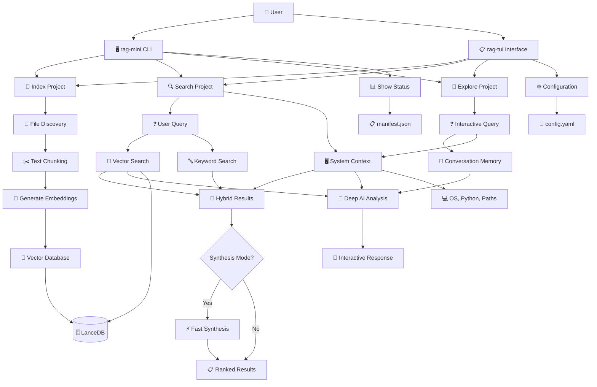
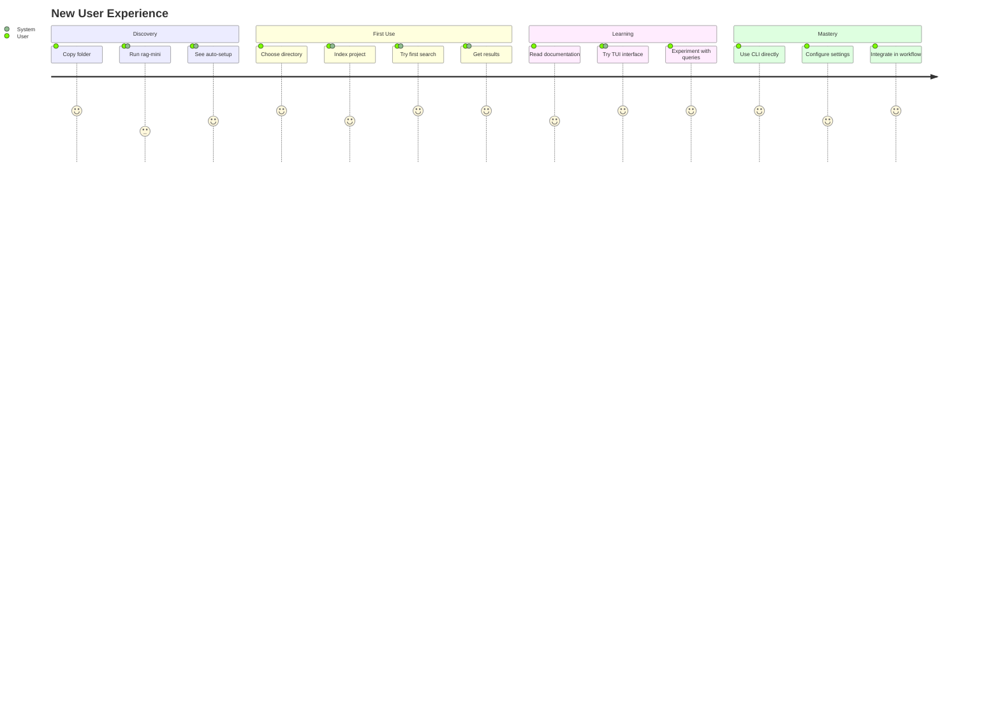
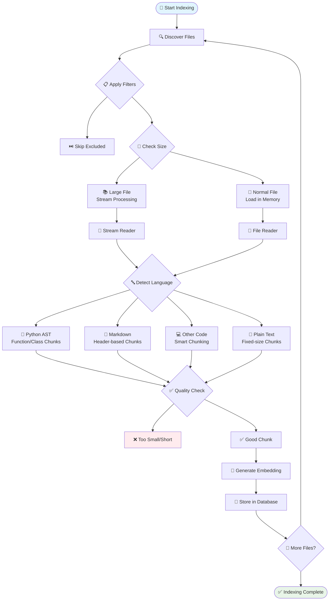
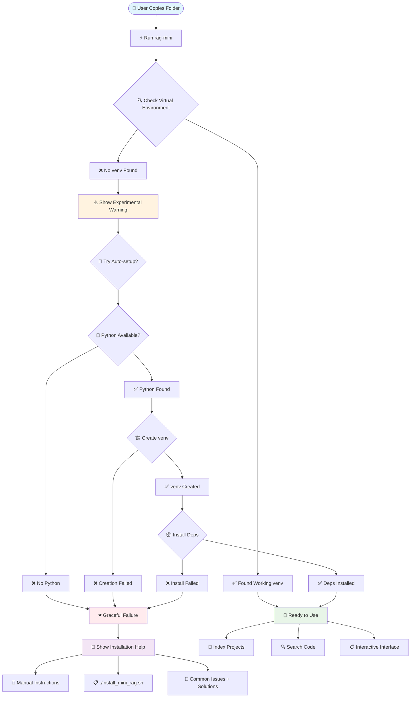
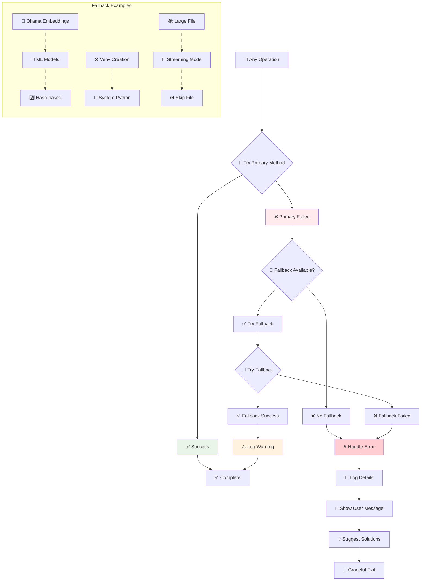
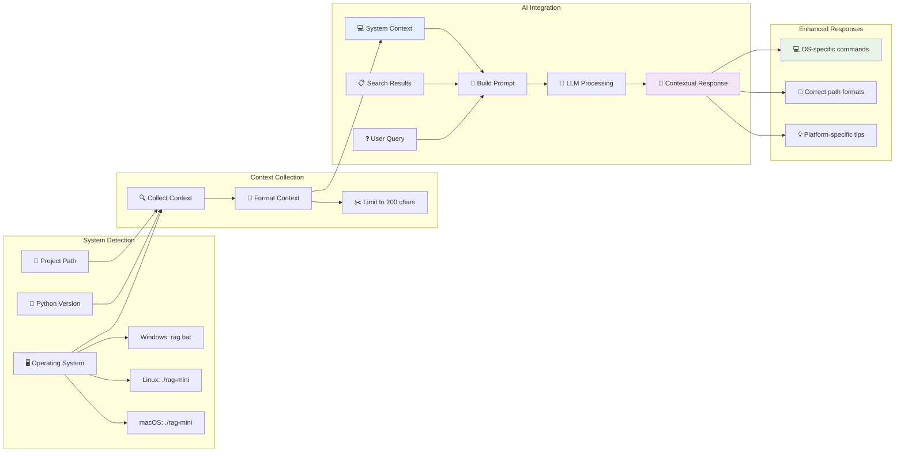
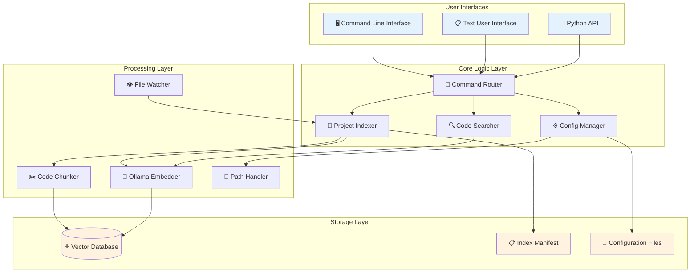

# FSS-Mini-RAG Visual Guide

> **Visual diagrams showing how the system works**  
> *Perfect for visual learners who want to understand the flow and architecture*

## Table of Contents

- [System Overview](#system-overview)
- [User Journey](#user-journey) 
- [File Processing Flow](#file-processing-flow)
- [Search Architecture](#search-architecture)
- [Installation Flow](#installation-flow)
- [Configuration System](#configuration-system)
- [System Context Integration](#system-context-integration)
- [Error Handling](#error-handling)

## System Overview



## User Journey



## File Processing Flow



## Search Architecture

```mermaid
graph TB
    Query[❓ User Query: "user authentication"] --> Process[🔧 Query Processing]
    
    Process --> Vector[🎯 Vector Search Path]
    Process --> Keyword[🔤 Keyword Search Path]
    
    subgraph "Vector Pipeline"
        Vector --> Embed[🧠 Query → Embedding]
        Embed --> Similar[📊 Find Similar Vectors]
        Similar --> VScore[📈 Similarity Scores]
    end
    
    subgraph "Keyword Pipeline" 
        Keyword --> Terms[🔤 Extract Terms]
        Terms --> BM25[📊 BM25 Algorithm]
        BM25 --> KScore[📈 Keyword Scores]
    end
    
    subgraph "Hybrid Combination"
        VScore --> Merge[🔄 Merge Results]
        KScore --> Merge
        Merge --> Rank[📊 Advanced Ranking]
        Rank --> Boost[⬆️ Apply Boosts]
    end
    
    subgraph "Ranking Factors"
        Boost --> Exact[🎯 Exact Matches +30%]
        Boost --> Name[🏷️ Function Names +20%] 
        Boost --> Length[📏 Content Length]
        Boost --> Type[📝 Chunk Type]
    end
    
    Exact --> Final[📋 Final Results]
    Name --> Final
    Length --> Final
    Type --> Final
    
    Final --> Display[🖥️ Display to User]
    
    style Query fill:#e3f2fd
    style Final fill:#e8f5e8
    style Display fill:#f3e5f5
```

## Installation Flow



## Configuration System

```mermaid
graph LR
    subgraph "Configuration Sources"
        Default[🏭 Built-in Defaults]
        Global[🌍 ~/.config/fss-mini-rag/config.yaml]
        Project[📁 project/.mini-rag/config.yaml]
        Env[🔧 Environment Variables]
    end
    
    subgraph "Hierarchical Loading"
        Default --> Merge1[🔄 Merge]
        Global --> Merge1
        Merge1 --> Merge2[🔄 Merge]
        Project --> Merge2
        Merge2 --> Merge3[🔄 Merge]
        Env --> Merge3
    end
    
    Merge3 --> Final[⚙️ Final Configuration]
    
    subgraph "Configuration Areas"
        Final --> Chunking[✂️ Text Chunking<br/>• Max/min sizes<br/>• Strategy (semantic/fixed)]
        Final --> Embedding[🧠 Embeddings<br/>• Ollama settings<br/>• Fallback methods]
        Final --> Search[🔍 Search Behavior<br/>• Result limits<br/>• Similarity thresholds]
        Final --> Files[📄 File Processing<br/>• Include/exclude patterns<br/>• Size limits]
        Final --> Streaming[🌊 Large File Handling<br/>• Streaming threshold<br/>• Memory management]
    end
    
    style Default fill:#e3f2fd
    style Final fill:#e8f5e8
    style Chunking fill:#f3e5f5
    style Embedding fill:#fff3e0
```

## Error Handling



## System Context Integration



*System context helps the AI provide better, platform-specific guidance without compromising privacy*

## Architecture Layers



---

*These diagrams provide a complete visual understanding of how FSS-Mini-RAG works under the hood, perfect for visual learners and developers who want to extend the system.*