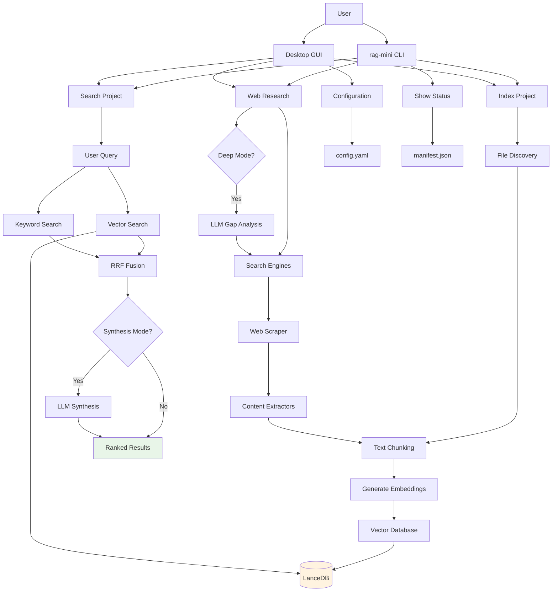
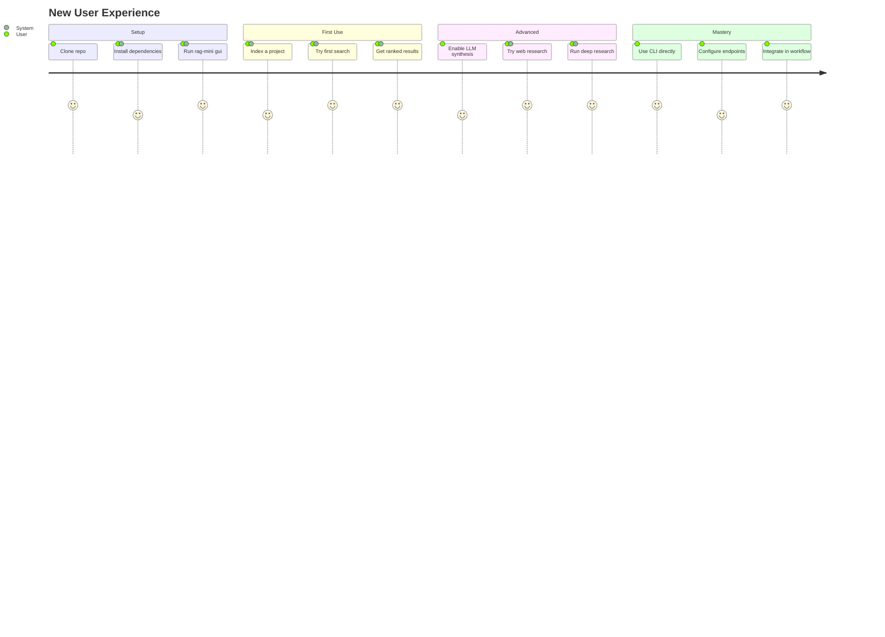
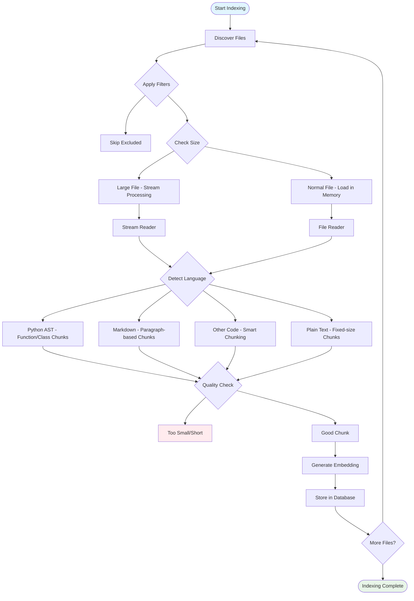
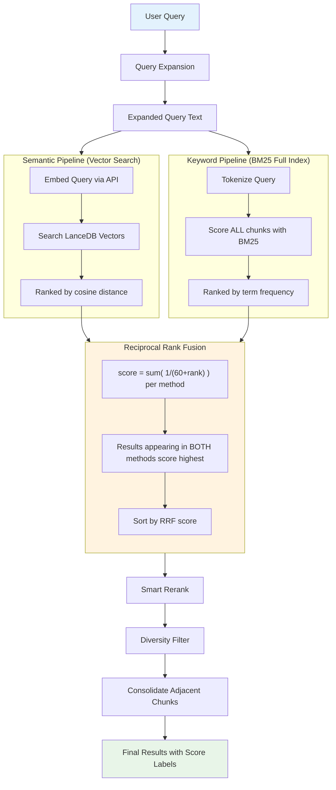
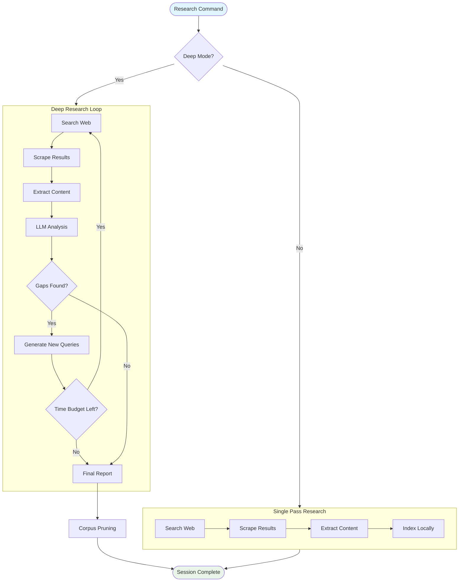
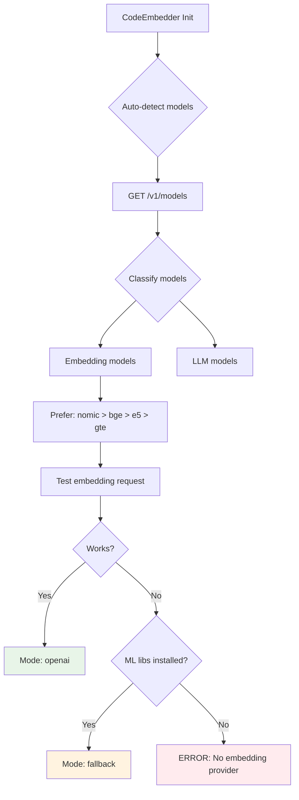
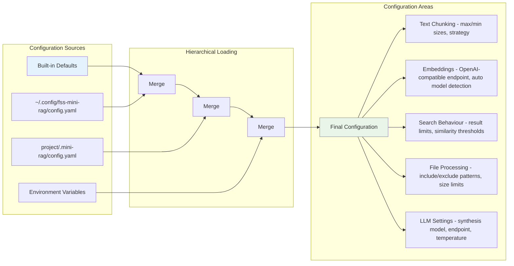
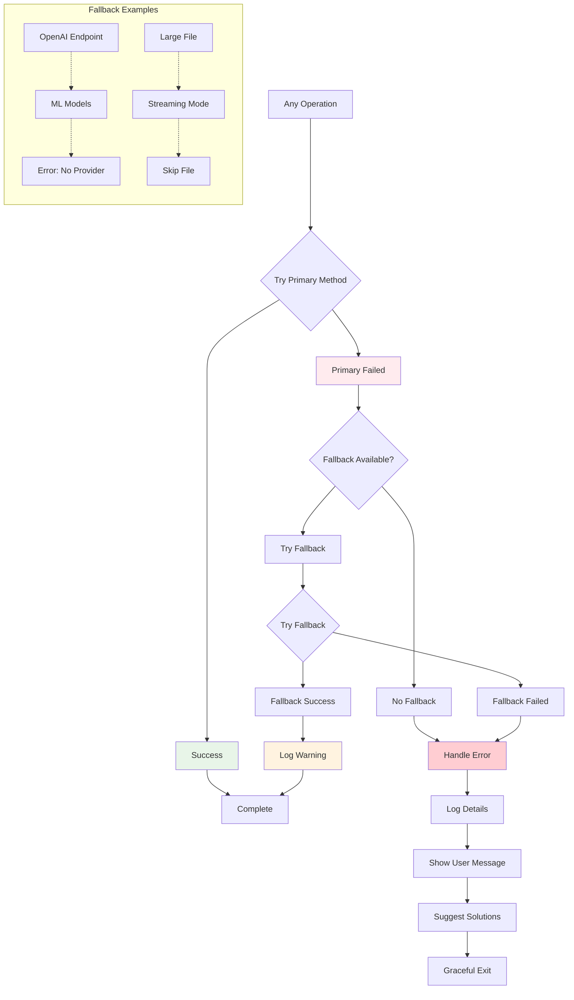
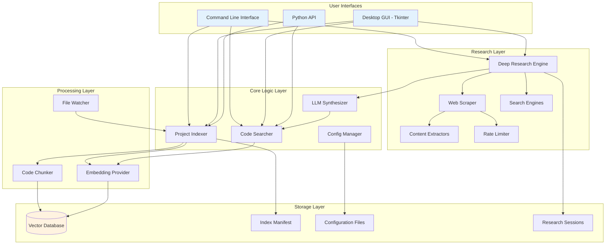

# FSS-Mini-RAG Visual Guide

> **Visual diagrams showing how the system works**
> *Perfect for visual learners who want to understand the flow and architecture*

## Table of Contents

- [System Overview](#system-overview)
- [User Journey](#user-journey)
- [File Processing Flow](#file-processing-flow)
- [Search Architecture](#search-architecture)
- [Web Research Pipeline](#web-research-pipeline)
- [Embedding Provider Chain](#embedding-provider-chain)
- [Configuration System](#configuration-system)
- [Error Handling](#error-handling)

## System Overview

```mermaid
graph TB
    User[User] --> CLI[rag-mini CLI]
    User --> GUI[Desktop GUI]

    CLI --> Index[Index Project]
    CLI --> Search[Search Project]
    CLI --> Research[Web Research]
    CLI --> Status[Show Status]

    GUI --> Index
    GUI --> Search
    GUI --> Research
    GUI --> Config[Configuration]

    Index --> Files[File Discovery]
    Files --> Chunk[Text Chunking]
    Chunk --> Embed[Generate Embeddings]
    Embed --> Store[Vector Database]

    Search --> Query[User Query]
    Query --> Vector[Vector Search]
    Query --> Keyword[Keyword Search]
    Vector --> Combine[RRF Fusion]
    Keyword --> Combine
    Combine --> Synthesize{Synthesis Mode?}

    Synthesize -->|Yes| FastLLM[LLM Synthesis]
    Synthesize -->|No| Results[Ranked Results]
    FastLLM --> Results

    Research --> WebSearch[Search Engines]
    WebSearch --> Scrape[Web Scraper]
    Scrape --> Extract[Content Extractors]
    Extract --> Chunk
    Research --> DeepLoop{Deep Mode?}
    DeepLoop -->|Yes| Analyze[LLM Gap Analysis]
    Analyze --> WebSearch

    Store --> LanceDB[(LanceDB)]
    Vector --> LanceDB

    Config --> YAML[config.yaml]
    Status --> Manifest[manifest.json]

    style Results fill:#e8f5e8
    style LanceDB fill:#fff3e0
```

## User Journey

```mermaid
journey
    title New User Experience
    section Setup
      Clone repo: 5: User
      Install dependencies: 4: User, System
      Run rag-mini gui: 5: User, System
    section First Use
      Index a project: 4: User, System
      Try first search: 5: User, System
      Get ranked results: 5: User, System
    section Advanced
      Enable LLM synthesis: 4: User
      Try web research: 5: User, System
      Run deep research: 5: User, System
    section Mastery
      Use CLI directly: 5: User
      Configure endpoints: 4: User
      Integrate in workflow: 5: User
```

## File Processing Flow

```mermaid
flowchart TD
    Start([Start Indexing]) --> Discover[Discover Files]

    Discover --> Filter{Apply Filters}
    Filter --> Skip[Skip Excluded]
    Filter --> Check{Check Size}

    Check --> Large[Large File - Stream Processing]
    Check --> Small[Normal File - Load in Memory]

    Large --> Stream[Stream Reader]
    Small --> Read[File Reader]

    Stream --> Language{Detect Language}
    Read --> Language

    Language --> Python[Python AST - Function/Class Chunks]
    Language --> Markdown[Markdown - Paragraph-based Chunks]
    Language --> Code[Other Code - Smart Chunking]
    Language --> Text[Plain Text - Fixed-size Chunks]

    Python --> Validate{Quality Check}
    Markdown --> Validate
    Code --> Validate
    Text --> Validate

    Validate --> Reject[Too Small/Short]
    Validate --> Accept[Good Chunk]

    Accept --> Embed[Generate Embedding]
    Embed --> Store[Store in Database]

    Store --> More{More Files?}
    More --> Discover
    More --> Done([Indexing Complete])

    style Start fill:#e1f5fe
    style Done fill:#e8f5e8
    style Reject fill:#ffebee
```

## Search Architecture

Independent dual-pipeline search with Reciprocal Rank Fusion, adapted from the Fss-Rag hybrid search pattern. Semantic and keyword searches run independently against the full index, then results are merged by rank position.

```mermaid
graph TB
    Query[User Query] --> Expand[Query Expansion]
    Expand --> QText[Expanded Query Text]

    QText --> SemanticPath
    QText --> KeywordPath

    subgraph SemanticPath["Semantic Pipeline (Vector Search)"]
        direction TB
        SE[Embed Query via API] --> SV[Search LanceDB Vectors]
        SV --> SR[Ranked by cosine distance]
    end

    subgraph KeywordPath["Keyword Pipeline (BM25 Full Index)"]
        direction TB
        KT[Tokenize Query] --> KB[Score ALL chunks with BM25]
        KB --> KR[Ranked by term frequency]
    end

    SR --> RRF
    KR --> RRF

    subgraph RRF["Reciprocal Rank Fusion"]
        direction TB
        R1["score = sum( 1/(60+rank) ) per method"]
        R1 --> R2[Results appearing in BOTH methods score highest]
        R2 --> R3[Sort by RRF score]
    end

    RRF --> Rerank[Smart Rerank]
    Rerank --> Diversity[Diversity Filter]
    Diversity --> Consolidate[Consolidate Adjacent Chunks]
    Consolidate --> Display[Final Results with Score Labels]

    style Query fill:#e3f2fd
    style RRF fill:#fff3e0
    style Display fill:#e8f5e8
```

**Key design decisions (from Fss-Rag patterns):**

- **Independent execution**: BM25 searches the FULL index, not just the vector shortlist. This means keyword matches are found even when embeddings are poor.
- **RRF over weighted average**: Rank-based fusion works across different score distributions without normalization. A result at rank 1 in both methods scores higher than rank 1 in only one.
- **No hash mode in search**: If embedder has no real embeddings, semantic search is skipped entirely and only BM25 runs. Hash vectors are random noise that hurts fusion.

## Web Research Pipeline

```mermaid
flowchart TD
    Start([Research Command]) --> Mode{Deep Mode?}

    Mode -->|No| SinglePass
    Mode -->|Yes| DeepLoop

    subgraph SinglePass["Single Pass Research"]
        S1[Search Web] --> S2[Scrape Results]
        S2 --> S3[Extract Content]
        S3 --> S4[Index Locally]
    end

    subgraph DeepLoop["Deep Research Loop"]
        D1[Search Web] --> D2[Scrape Results]
        D2 --> D3[Extract Content]
        D3 --> D4[LLM Analysis]
        D4 --> D5{Gaps Found?}
        D5 -->|Yes| D6[Generate New Queries]
        D6 --> D7{Time Budget Left?}
        D7 -->|Yes| D1
        D7 -->|No| D8[Final Report]
        D5 -->|No| D8
    end

    SinglePass --> Done([Session Complete])
    D8 --> Prune[Corpus Pruning]
    Prune --> Done

    style Start fill:#e1f5fe
    style Done fill:#e8f5e8
```

**Search engines:** DuckDuckGo (with HTML fallback), Tavily, Brave
**Extractors:** HTML, PDF, arXiv, GitHub
**Pruning:** Vector-based cosine similarity using indexed embeddings (>=0.95 duplicate, 0.60-0.80 corroboration). Falls back to trigram Jaccard when index unavailable.

## Embedding Provider Chain

```mermaid
flowchart TD
    Init[CodeEmbedder Init] --> AutoDetect{Auto-detect models}
    AutoDetect --> ListModels[GET /v1/models]
    ListModels --> Classify{Classify models}
    Classify --> EmbModels[Embedding models]
    Classify --> LLMModels[LLM models]

    EmbModels --> SelectBest[Prefer: nomic > bge > e5 > gte]
    SelectBest --> TestEmbed[Test embedding request]
    TestEmbed --> Success{Works?}

    Success -->|Yes| OpenAI[Mode: openai]
    Success -->|No| TryML{ML libs installed?}

    TryML -->|Yes| MLMode[Mode: fallback]
    TryML -->|No| Fail[ERROR: No embedding provider]

    style OpenAI fill:#e8f5e8
    style MLMode fill:#fff3e0
    style Fail fill:#ffebee
```

## Configuration System

```mermaid
graph LR
    subgraph "Configuration Sources"
        Default[Built-in Defaults]
        Global[~/.config/fss-mini-rag/config.yaml]
        Project[project/.mini-rag/config.yaml]
        Env[Environment Variables]
    end

    subgraph "Hierarchical Loading"
        Default --> Merge1[Merge]
        Global --> Merge1
        Merge1 --> Merge2[Merge]
        Project --> Merge2
        Merge2 --> Merge3[Merge]
        Env --> Merge3
    end

    Merge3 --> Final[Final Configuration]

    subgraph "Configuration Areas"
        Final --> Chunking[Text Chunking - max/min sizes, strategy]
        Final --> Embedding[Embeddings - OpenAI-compatible endpoint, auto model detection]
        Final --> Search[Search Behaviour - result limits, similarity thresholds]
        Final --> Files[File Processing - include/exclude patterns, size limits]
        Final --> LLM[LLM Settings - synthesis model, endpoint, temperature]
    end

    style Default fill:#e3f2fd
    style Final fill:#e8f5e8
```

## Error Handling

```mermaid
flowchart TD
    Operation[Any Operation] --> Try{Try Primary Method}

    Try --> Success[Success] --> Done[Complete]
    Try --> Fail[Primary Failed] --> Fallback{Fallback Available?}

    Fallback --> NoFallback[No Fallback] --> Error
    Fallback --> HasFallback[Try Fallback] --> FallbackTry{Try Fallback}

    FallbackTry --> FallbackOK[Fallback Success] --> Warn[Log Warning] --> Done
    FallbackTry --> FallbackFail[Fallback Failed] --> Error

    Error[Handle Error] --> Log[Log Details]
    Log --> UserMsg[Show User Message]
    UserMsg --> Suggest[Suggest Solutions]
    Suggest --> Exit[Graceful Exit]

    subgraph "Fallback Examples"
        direction TB
        OpenAIEmb[OpenAI Endpoint] -.-> ML[ML Models]
        ML -.-> NoEmbed[Error: No Provider]

        LargeFile[Large File] -.-> Stream[Streaming Mode]
        Stream -.-> SkipFile[Skip File]
    end

    style Success fill:#e8f5e8
    style Fail fill:#ffebee
    style Warn fill:#fff3e0
    style Error fill:#ffcdd2
```

## Architecture Layers

```mermaid
graph TB
    subgraph "User Interfaces"
        CLI[Command Line Interface]
        GUI[Desktop GUI - Tkinter]
        Python[Python API]
    end

    subgraph "Core Logic Layer"
        Indexer[Project Indexer]
        Searcher[Code Searcher]
        Config[Config Manager]
        LLMSynth[LLM Synthesizer]
    end

    subgraph "Research Layer"
        DeepResearch[Deep Research Engine]
        WebScraper[Web Scraper]
        SearchEngines[Search Engines]
        Extractors[Content Extractors]
        RateLimiter[Rate Limiter]
    end

    subgraph "Processing Layer"
        Chunker[Code Chunker]
        Embedder[Embedding Provider]
        Watcher[File Watcher]
    end

    subgraph "Storage Layer"
        LanceDB[(Vector Database)]
        Manifest[Index Manifest]
        ConfigFile[Configuration Files]
        Sessions[Research Sessions]
    end

    CLI --> Indexer
    CLI --> Searcher
    CLI --> DeepResearch
    GUI --> Indexer
    GUI --> Searcher
    GUI --> DeepResearch
    Python --> Indexer
    Python --> Searcher

    Indexer --> Chunker
    Indexer --> Embedder
    Searcher --> Embedder
    LLMSynth --> Searcher
    DeepResearch --> SearchEngines
    DeepResearch --> WebScraper
    DeepResearch --> LLMSynth
    WebScraper --> Extractors
    WebScraper --> RateLimiter

    Chunker --> LanceDB
    Embedder --> LanceDB
    Indexer --> Manifest
    Config --> ConfigFile
    DeepResearch --> Sessions

    Watcher --> Indexer

    style CLI fill:#e3f2fd
    style GUI fill:#e3f2fd
    style Python fill:#e3f2fd
    style LanceDB fill:#fff3e0
```

---

*These diagrams provide a complete visual understanding of how FSS-Mini-RAG works, including the search pipeline, web research engine, and desktop GUI.*
