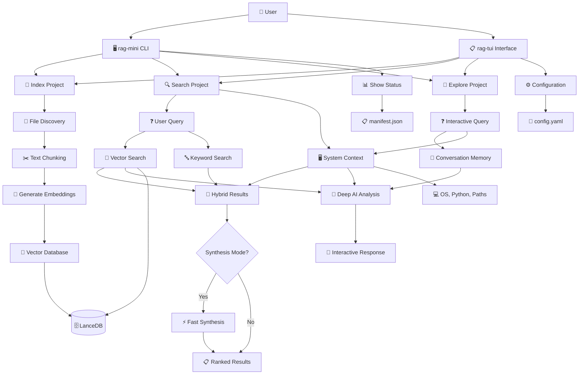
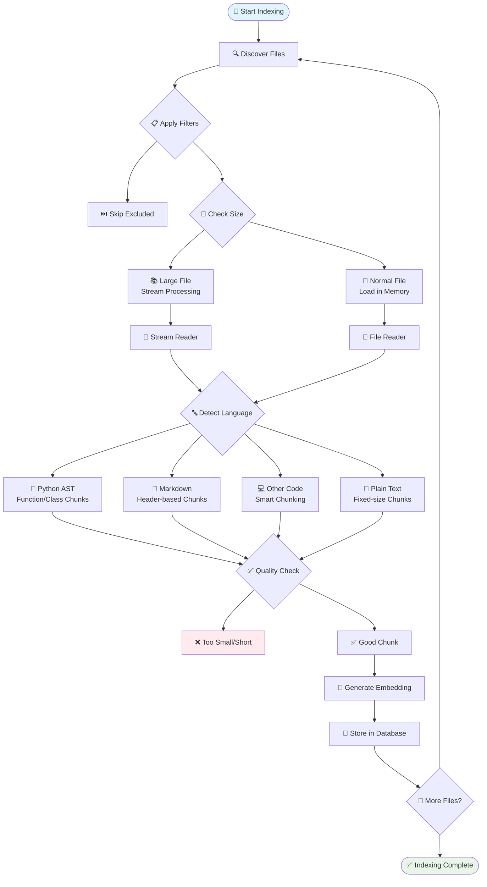
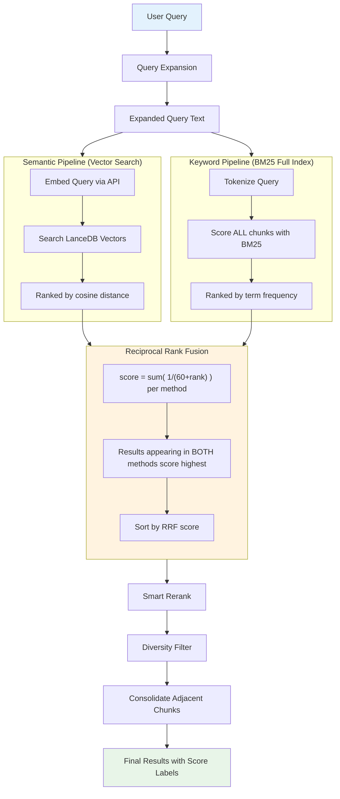
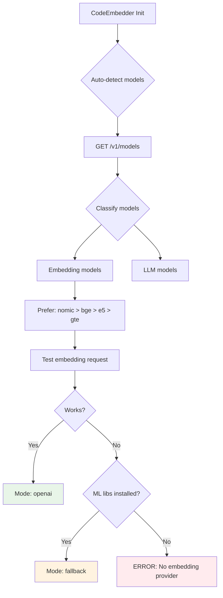
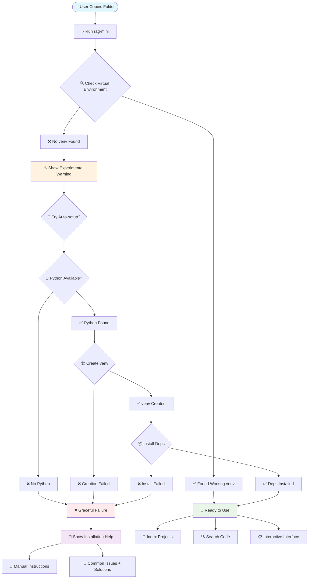
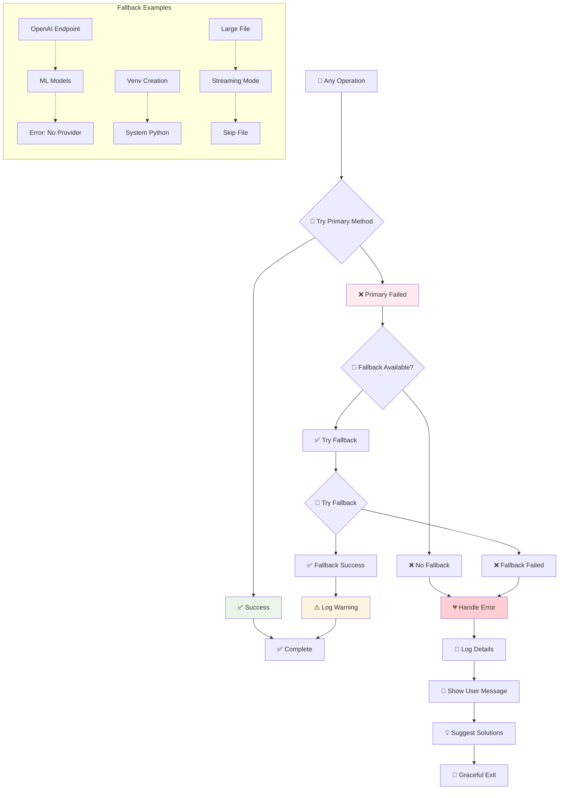
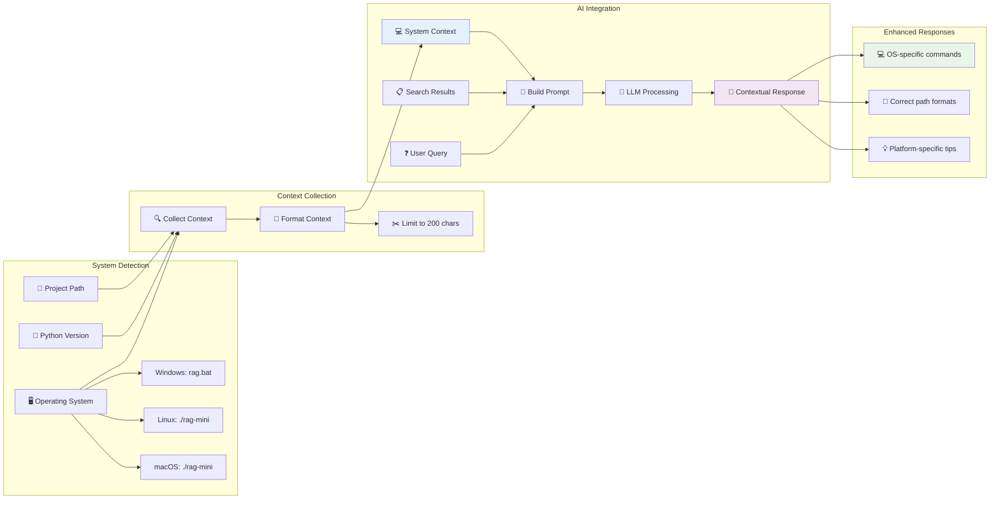
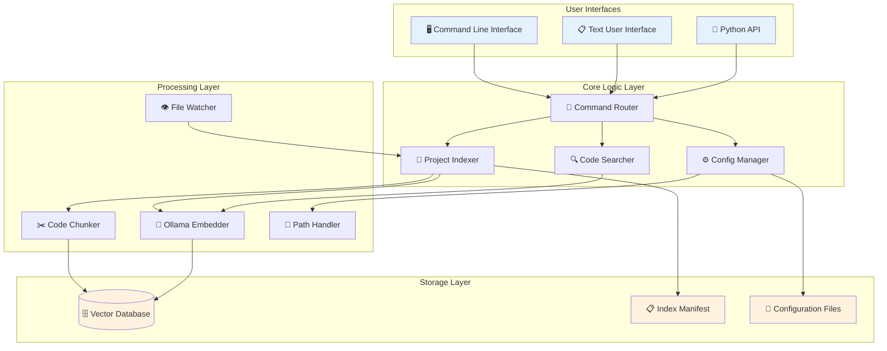

# FSS-Mini-RAG Visual Guide

> **Visual diagrams showing how the system works**  
> *Perfect for visual learners who want to understand the flow and architecture*

## Table of Contents

- [System Overview](#system-overview)
- [User Journey](#user-journey) 
- [File Processing Flow](#file-processing-flow)
- [Search Architecture](#search-architecture)
- [Installation Flow](#installation-flow)
- [Configuration System](#configuration-system)
- [System Context Integration](#system-context-integration)
- [Error Handling](#error-handling)

## System Overview

```mermaid
graph TB
    User[👤 User] --> CLI[🖥️ rag-mini CLI]
    User --> TUI[📋 rag-tui Interface]
    
    CLI --> Index[📁 Index Project]
    CLI --> Search[🔍 Search Project]
    CLI --> Explore[🧠 Explore Project]
    CLI --> Status[📊 Show Status]
    
    TUI --> Index
    TUI --> Search
    TUI --> Explore
    TUI --> Config[⚙️ Configuration]
    
    Index --> Files[📄 File Discovery]
    Files --> Chunk[✂️ Text Chunking]
    Chunk --> Embed[🧠 Generate Embeddings]
    Embed --> Store[💾 Vector Database]
    
    Search --> Query[❓ User Query]
    Search --> Context[🖥️ System Context]
    Query --> Vector[🎯 Vector Search]
    Query --> Keyword[🔤 Keyword Search]
    Vector --> Combine[🔄 Hybrid Results]
    Keyword --> Combine
    Context --> Combine
    Combine --> Synthesize{Synthesis Mode?}
    
    Synthesize -->|Yes| FastLLM[⚡ Fast Synthesis]
    Synthesize -->|No| Results[📋 Ranked Results]
    FastLLM --> Results
    
    Explore --> ExploreQuery[❓ Interactive Query]
    ExploreQuery --> Memory[🧠 Conversation Memory]
    ExploreQuery --> Context
    Memory --> DeepLLM[🤔 Deep AI Analysis]
    Context --> DeepLLM
    Vector --> DeepLLM
    DeepLLM --> Interactive[💬 Interactive Response]
    
    Store --> LanceDB[(🗄️ LanceDB)]
    Vector --> LanceDB
    
    Config --> YAML[📝 config.yaml]
    Status --> Manifest[📋 manifest.json]
    Context --> SystemInfo[💻 OS, Python, Paths]
```

## User Journey

```mermaid
journey
    title New User Experience
    section Discovery
      Copy folder: 5: User
      Run rag-mini: 3: User, System
      See auto-setup: 4: User, System
    section First Use
      Choose directory: 5: User
      Index project: 4: User, System
      Try first search: 5: User, System
      Get results: 5: User, System
    section Learning
      Read documentation: 4: User
      Try TUI interface: 5: User, System
      Experiment with queries: 5: User
    section Mastery
      Use CLI directly: 5: User
      Configure settings: 4: User
      Integrate in workflow: 5: User
```

## File Processing Flow

```mermaid
flowchart TD
    Start([🚀 Start Indexing]) --> Discover[🔍 Discover Files]
    
    Discover --> Filter{📋 Apply Filters}
    Filter --> Skip[⏭️ Skip Excluded]
    Filter --> Check{📏 Check Size}
    
    Check --> Large[📚 Large File<br/>Stream Processing]
    Check --> Small[📄 Normal File<br/>Load in Memory]
    
    Large --> Stream[🌊 Stream Reader]
    Small --> Read[📖 File Reader]
    
    Stream --> Language{🔤 Detect Language}
    Read --> Language
    
    Language --> Python[🐍 Python AST<br/>Function/Class Chunks]
    Language --> Markdown[📝 Markdown<br/>Header-based Chunks]
    Language --> Code[💻 Other Code<br/>Smart Chunking]
    Language --> Text[📄 Plain Text<br/>Fixed-size Chunks]
    
    Python --> Validate{✅ Quality Check}
    Markdown --> Validate
    Code --> Validate
    Text --> Validate
    
    Validate --> Reject[❌ Too Small/Short]
    Validate --> Accept[✅ Good Chunk]
    
    Accept --> Embed[🧠 Generate Embedding]
    Embed --> Store[💾 Store in Database]
    
    Store --> More{🔄 More Files?}
    More --> Discover
    More --> Done([✅ Indexing Complete])
    
    style Start fill:#e1f5fe
    style Done fill:#e8f5e8
    style Reject fill:#ffebee
```

## Search Architecture

Independent dual-pipeline search with Reciprocal Rank Fusion, adapted from the Fss-Rag hybrid search pattern. Semantic and keyword searches run independently against the full index, then results are merged by rank position.

```mermaid
graph TB
    Query[User Query] --> Expand[Query Expansion]
    Expand --> QText[Expanded Query Text]

    QText --> SemanticPath
    QText --> KeywordPath

    subgraph SemanticPath["Semantic Pipeline (Vector Search)"]
        direction TB
        SE[Embed Query via API] --> SV[Search LanceDB Vectors]
        SV --> SR[Ranked by cosine distance]
    end

    subgraph KeywordPath["Keyword Pipeline (BM25 Full Index)"]
        direction TB
        KT[Tokenize Query] --> KB[Score ALL chunks with BM25]
        KB --> KR[Ranked by term frequency]
    end

    SR --> RRF
    KR --> RRF

    subgraph RRF["Reciprocal Rank Fusion"]
        direction TB
        R1["score = sum( 1/(60+rank) ) per method"]
        R1 --> R2[Results appearing in BOTH methods score highest]
        R2 --> R3[Sort by RRF score]
    end

    RRF --> Rerank[Smart Rerank]
    Rerank --> Diversity[Diversity Filter]
    Diversity --> Consolidate[Consolidate Adjacent Chunks]
    Consolidate --> Display[Final Results with Score Labels]

    style Query fill:#e3f2fd
    style RRF fill:#fff3e0
    style Display fill:#e8f5e8
```

**Key design decisions (from Fss-Rag patterns):**

- **Independent execution**: BM25 searches the FULL index, not just the vector shortlist. This means keyword matches are found even when embeddings are poor.
- **RRF over weighted average**: Rank-based fusion works across different score distributions without normalization. A result at rank 1 in both methods scores higher than rank 1 in only one.
- **Query analysis**: Fss-Rag uses `HybridSearchStrategy` to analyze query characteristics (technical terms boost keyword weight, conceptual questions boost semantic weight). Mini-rag uses fixed weights for simplicity.
- **No hash mode in search**: If embedder is in hash mode (no real embeddings), semantic search is skipped entirely and only BM25 runs. Hash vectors are random noise that hurts fusion.

## Embedding Provider Chain

```mermaid
flowchart TD
    Init[CodeEmbedder Init] --> AutoDetect{Auto-detect models}
    AutoDetect --> ListModels[GET /v1/models]
    ListModels --> Classify{Classify models}
    Classify --> EmbModels[Embedding models]
    Classify --> LLMModels[LLM models]

    EmbModels --> SelectBest[Prefer: nomic > bge > e5 > gte]
    SelectBest --> TestEmbed[Test embedding request]
    TestEmbed --> Success{Works?}

    Success -->|Yes| OpenAI[Mode: openai]
    Success -->|No| TryML{ML libs installed?}

    TryML -->|Yes| MLMode[Mode: fallback]
    TryML -->|No| Fail[ERROR: No embedding provider]

    style OpenAI fill:#e8f5e8
    style MLMode fill:#fff3e0
    style Fail fill:#ffebee
```

## Installation Flow

```mermaid
flowchart TD
    Start([👤 User Copies Folder]) --> Run[⚡ Run rag-mini]
    
    Run --> Check{🔍 Check Virtual Environment}
    Check --> Found[✅ Found Working venv] 
    Check --> Missing[❌ No venv Found]
    
    Found --> Ready[🚀 Ready to Use]
    
    Missing --> Warning[⚠️ Show Experimental Warning]
    Warning --> Auto{🤖 Try Auto-setup?}
    
    Auto --> Python{🐍 Python Available?}
    Python --> No[❌ No Python] --> Fail
    Python --> Yes[✅ Python Found] --> Create{🏗️ Create venv}
    
    Create --> Failed[❌ Creation Failed] --> Fail
    Create --> Success[✅ venv Created] --> Install{📦 Install Deps}
    
    Install --> InstallFail[❌ Install Failed] --> Fail
    Install --> InstallOK[✅ Deps Installed] --> Ready
    
    Fail[💔 Graceful Failure] --> Help[📖 Show Installation Help]
    Help --> Manual[🔧 Manual Instructions]
    Help --> Issues[🚨 Common Issues + Solutions]
    
    Ready --> Index[📁 Index Projects]
    Ready --> Search[🔍 Search Code]
    Ready --> TUI[📋 Interactive Interface]
    
    style Start fill:#e1f5fe
    style Ready fill:#e8f5e8
    style Warning fill:#fff3e0
    style Fail fill:#ffebee
    style Help fill:#f3e5f5
```

## Configuration System

```mermaid
graph LR
    subgraph "Configuration Sources"
        Default[🏭 Built-in Defaults]
        Global[🌍 ~/.config/fss-mini-rag/config.yaml]
        Project[📁 project/.mini-rag/config.yaml]
        Env[🔧 Environment Variables]
    end
    
    subgraph "Hierarchical Loading"
        Default --> Merge1[🔄 Merge]
        Global --> Merge1
        Merge1 --> Merge2[🔄 Merge]
        Project --> Merge2
        Merge2 --> Merge3[🔄 Merge]
        Env --> Merge3
    end
    
    Merge3 --> Final[⚙️ Final Configuration]
    
    subgraph "Configuration Areas"
        Final --> Chunking[✂️ Text Chunking<br/>• Max/min sizes<br/>• Strategy (semantic/fixed)]
        Final --> Embedding[🧠 Embeddings<br/>• OpenAI-compatible endpoint<br/>• Auto model detection<br/>• Provider: openai/ollama/ml]
        Final --> Search[🔍 Search Behavior<br/>• Result limits<br/>• Similarity thresholds]
        Final --> Files[📄 File Processing<br/>• Include/exclude patterns<br/>• Size limits]
        Final --> Streaming[🌊 Large File Handling<br/>• Streaming threshold<br/>• Memory management]
    end
    
    style Default fill:#e3f2fd
    style Final fill:#e8f5e8
    style Chunking fill:#f3e5f5
    style Embedding fill:#fff3e0
```

## Error Handling

```mermaid
flowchart TD
    Operation[🔧 Any Operation] --> Try{🎯 Try Primary Method}
    
    Try --> Success[✅ Success] --> Done[✅ Complete]
    Try --> Fail[❌ Primary Failed] --> Fallback{🔄 Fallback Available?}
    
    Fallback --> NoFallback[❌ No Fallback] --> Error
    Fallback --> HasFallback[✅ Try Fallback] --> FallbackTry{🎯 Try Fallback}
    
    FallbackTry --> FallbackOK[✅ Fallback Success] --> Warn[⚠️ Log Warning] --> Done
    FallbackTry --> FallbackFail[❌ Fallback Failed] --> Error
    
    Error[💔 Handle Error] --> Log[📝 Log Details]
    Log --> UserMsg[👤 Show User Message]
    UserMsg --> Suggest[💡 Suggest Solutions]
    Suggest --> Exit[🚪 Graceful Exit]
    
    subgraph "Fallback Examples"
        direction TB
        OpenAIEmb[OpenAI Endpoint] -.-> ML[ML Models]
        ML -.-> NoEmbed[Error: No Provider]

        VenvFail[Venv Creation] -.-> SystemPy[System Python]

        LargeFile[Large File] -.-> Stream[Streaming Mode]
        Stream -.-> Skip[Skip File]
    end
    
    style Success fill:#e8f5e8
    style Fail fill:#ffebee
    style Warn fill:#fff3e0
    style Error fill:#ffcdd2
```

## System Context Integration

```mermaid
graph LR
    subgraph "System Detection"
        OS[🖥️ Operating System]
        Python[🐍 Python Version] 
        Project[📁 Project Path]
        
        OS --> Windows[Windows: rag.bat]
        OS --> Linux[Linux: ./rag-mini]
        OS --> macOS[macOS: ./rag-mini]
    end
    
    subgraph "Context Collection"
        Collect[🔍 Collect Context]
        OS --> Collect
        Python --> Collect
        Project --> Collect
        
        Collect --> Format[📝 Format Context]
        Format --> Limit[✂️ Limit to 200 chars]
    end
    
    subgraph "AI Integration"
        UserQuery[❓ User Query] 
        SearchResults[📋 Search Results]
        SystemContext[💻 System Context]
        
        UserQuery --> Prompt[📝 Build Prompt]
        SearchResults --> Prompt
        SystemContext --> Prompt
        
        Prompt --> AI[🤖 LLM Processing]
        AI --> Response[💬 Contextual Response]
    end
    
    subgraph "Enhanced Responses"
        Response --> Commands[💻 OS-specific commands]
        Response --> Paths[📂 Correct path formats]
        Response --> Tips[💡 Platform-specific tips]
    end
    
    Format --> SystemContext
    
    style SystemContext fill:#e3f2fd
    style Response fill:#f3e5f5
    style Commands fill:#e8f5e8
```

*System context helps the AI provide better, platform-specific guidance without compromising privacy*

## Architecture Layers

```mermaid
graph TB
    subgraph "User Interfaces"
        CLI[🖥️ Command Line Interface]
        TUI[📋 Text User Interface]
        Python[🐍 Python API]
    end
    
    subgraph "Core Logic Layer"
        Router[🚏 Command Router]
        Indexer[📁 Project Indexer]
        Searcher[🔍 Code Searcher]
        Config[⚙️ Config Manager]
    end
    
    subgraph "Processing Layer"
        Chunker[✂️ Code Chunker]
        Embedder[🧠 Ollama Embedder]
        Watcher[👁️ File Watcher]
        PathHandler[📂 Path Handler]
    end
    
    subgraph "Storage Layer"
        LanceDB[(🗄️ Vector Database)]
        Manifest[📋 Index Manifest]
        ConfigFile[📝 Configuration Files]
    end
    
    CLI --> Router
    TUI --> Router
    Python --> Router
    
    Router --> Indexer
    Router --> Searcher
    Router --> Config
    
    Indexer --> Chunker
    Indexer --> Embedder
    Searcher --> Embedder
    Config --> PathHandler
    
    Chunker --> LanceDB
    Embedder --> LanceDB
    Indexer --> Manifest
    Config --> ConfigFile
    
    Watcher --> Indexer
    
    style CLI fill:#e3f2fd
    style TUI fill:#e3f2fd
    style Python fill:#e3f2fd
    style LanceDB fill:#fff3e0
    style Manifest fill:#fff3e0
    style ConfigFile fill:#fff3e0
```

---

*These diagrams provide a complete visual understanding of how FSS-Mini-RAG works under the hood, perfect for visual learners and developers who want to extend the system.*