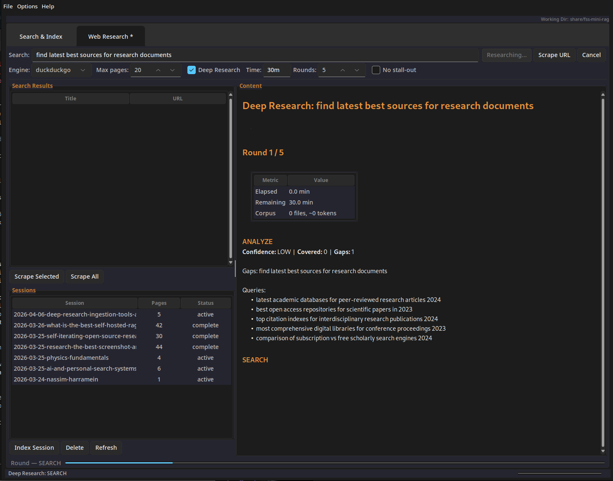

# FSS-Mini-RAG Desktop GUI

> **A complete visual guide to the desktop application**

Launch the GUI with:
```bash
rag-mini gui
```

The application opens with the Sun Valley dark theme (toggle light mode from Options > Toggle Dark/Light).


*The main window: Search & Index tab with collection panel, search bar, results table, and content viewer*

---

## Window Layout

The GUI has a **two-tab layout** with a shared status bar:

```
+------------------------------------------------------------------+
|  File  Options  Help                            Working Dir: ~/   |
+------------------------------------------------------------------+
|  [ Search & Index ]  [ Web Research ]                            |
|                                                                  |
|  +-------------+  +------------------------------------------+  |
|  | Collections |  |  Search: [________________________] [Go] |  |
|  |             |  |  ( ) Search  ( ) Ask   [ ] Expand query  |  |
|  | > my-proj   |  +------------------------------------------+  |
|  |   docs      |  | Score  | File         | Name    | Type   |  |
|  |             |  |--------|--------------|---------|--------|  |
|  | [+Add]      |  | HIGH   | auth.py:12   | login   | func   |  |
|  | [Re-index]  |  | GOOD   | session.py:4 | Session | class  |  |
|  | [Delete]    |  | FAIR   | middleware.. | check.. | func   |  |
|  +-------------+  +------------------------------------------+  |
|                   |                                          |  |
|                   |  def login(email, password):             |  |
|                   |      """Authenticate user."""             |  |
|                   |      user = find_by_email(email)         |  |
|                   |      if user and verify(password):       |  |
|                   |          return create_session(user)     |  |
|                   |                                          |  |
|                   +------------------------------------------+  |
+------------------------------------------------------------------+
|  Connected | 3 results in 18ms | 42 chunks indexed               |
+------------------------------------------------------------------+
```

---

## Search & Index Tab

This is the primary interface for working with local codebases and document collections.

### Collections Panel (Left)


The left sidebar manages your indexed projects:

- **+ Add** — Open a folder picker to add a new project. The folder is immediately indexed.
- **Re-index** — Force a complete re-index of the selected collection (useful after changing settings).
- **Delete** — Remove a collection from the list (the actual files are never touched).

Collections persist between sessions. The last-active collection is restored on startup.

### Search Bar


The search bar has two modes:

| Mode | What It Does |
|------|-------------|
| **Search** | Hybrid semantic + BM25 search. Returns ranked code/document chunks. |
| **Ask (LLM)** | Searches first, then sends results to an LLM for a synthesised answer. Streams the response live. |

**Options:**
- **Expand query** — Uses the LLM to add related terms before searching (e.g. "auth" becomes "auth authentication login session credentials").
- **Cancel** button appears during operations — click to stop a search or LLM stream mid-flight.

Type your query and press **Enter** or click **Go**.

### Results Table


Results are ranked by RRF fusion score with human-readable labels:

| Label | Meaning |
|-------|---------|
| **HIGH** | Excellent match — exactly what you're looking for |
| **GOOD** | Strong match — highly relevant |
| **FAIR** | Relevant — worth reviewing |
| **LOW** | Somewhat related |

Each result shows the file path, line numbers, chunk name (function/class), and chunk type. Click a row to view its full content below.

### Content Panel


The bottom panel shows the full content of the selected result. In **Ask (LLM)** mode, this becomes a rich text viewer:

- **Syntax-highlighted code blocks** — embedded as separate widgets
- **Tables** — rendered as native Treeview widgets
- **Clickable links** — open in your browser
- **Collapsible thinking blocks** — LLM reasoning shown in expandable sections


*Ask mode: the LLM streams its response live, with a collapsible thinking block showing its reasoning*

### Indexing Progress


When indexing a collection, the status bar shows:
- Files processed / total
- Chunks created
- Time elapsed
- Progress bar
- **Cancel** button to stop indexing mid-way (partial results are preserved)

---

## Web Research Tab


*The Web Research tab: search the web, scrape URLs, run deep research*

Switch to the **Web Research** tab to work with web content.

### Toolbar

The toolbar has two rows:

**Row 1: Query and Actions**
- **Search** — Search the web using the selected engine
- **Scrape URL** — Enter a URL to fetch and extract content
- **Cancel** — Stop the current operation

**Row 2: Options**
- **Engine** — Choose DuckDuckGo (no API key), Tavily, or Brave
- **Max pages** — Limit how many pages to scrape (1-100)
- **Deep Research** — Enable iterative research cycles (reveals time budget and rounds settings)

### Deep Research Options

When **Deep Research** is checked, additional controls appear:

| Control | Purpose |
|---------|---------|
| **Time** | Time budget (e.g. `30m`, `1h`, `2h`) |
| **Rounds** | Maximum research cycles (1-20) |
| **No stall-out** | Continue even if the engine detects diminishing returns |

### Search Results Panel (Left)

Web search results appear as a list with titles and URLs. Select results to view their snippets. Use the buttons below:

- **Scrape selected** — Download and extract the selected search results
- **Scrape all** — Download all search results
- **Index session** — Index the scraped content for semantic search

### Sessions Panel (Left, below results)

Previously scraped research sessions are listed here. Each session shows:
- Session name and date
- Number of sources
- Click to browse files

Right-click for options: **Open folder**, **Index**, **Delete**.

### Content Viewer (Right)

The right panel shows the full extracted content of the selected document or search result, rendered with the same RenderedMarkdown widget as the Search tab.

### Progress

During scraping or deep research, an inline progress bar appears below the toolbar showing:
- Current operation (searching, scraping, analyzing)
- Pages scraped / total
- For deep research: current round and phase

---

## Preferences

Open via **Options > Preferences** or use the keyboard shortcut.


*Preferences dialog with Endpoints, API Keys, and Connection tabs*

### Endpoints Tab

Configure where the GUI sends embedding and LLM requests:

- **Preset** dropdown — Quick selection: LM Studio (localhost:1234), Custom Remote, OpenAI, OpenAI Mini, Anthropic
- **Embedding URL** — The endpoint for generating embeddings
- **Embedding Model** — Select from discovered models or type `auto`
- **LLM URL** — The endpoint for synthesis and query expansion
- **LLM Model** — Select from discovered models or type `auto`
- **Refresh Models** button — Queries the endpoints to discover available models

### API Keys Tab

Manage API keys for cloud providers and search engines:
- OpenAI API key
- Anthropic API key
- Tavily search API key
- Brave search API key

Keys are stored in a `.env` file (gitignored). The display masks keys for security.

### Connection Tab

- **Test Connection** — Verifies both embedding and LLM endpoints are reachable
- **Cost tracking** — Set cost per 1M tokens for input/output to track spending
- **Save Custom Preset** — Save your current configuration as a reusable preset

---

## Theme

Toggle between dark and light mode:
- **Menu**: Options > Toggle Dark/Light


*Light theme: same layout, brighter colours*

The theme uses [Sun Valley TTK](https://github.com/rdbende/Sun-Valley-ttk-theme) for a modern, native-feeling appearance on all platforms.

---

## Keyboard Shortcuts

| Shortcut | Action |
|----------|--------|
| **Ctrl+F** | Focus the search bar |
| **Ctrl+N** | Add a new collection |
| **Ctrl+Q** / **Ctrl+W** | Close the application |
| **F1** | Show the help overlay |
| **Escape** | Cancel current operation / clear selection |
| **Enter** | Execute search (when search bar is focused) |

---

## First Launch

On first launch, a welcome dialog appears with quick-start instructions. After dismissing it:

1. Click **+ Add** in the Collections panel
2. Select a folder to index
3. Wait for indexing to complete (progress shown in status bar)
4. Type a query and press Enter
5. Click a result to view its content
6. Switch to **Ask (LLM)** mode for AI-synthesised answers

If no embedding server is running, searches still work using BM25 keyword matching. Start [LM Studio](https://lmstudio.ai/) with an embedding model for full semantic search.

---

## Screenshots Needed

> **Note:** This guide references screenshots that need to be captured from a running GUI instance. Save them to `docs/images/` with these filenames:

| Filename | What to Capture |
|----------|----------------|
| `gui-search-dark.png` | Main window, dark theme, with search results and content showing |
| `gui-search-light.png` | Same view, light theme |
| `gui-collections.png` | Collections panel with at least one indexed project |
| `gui-search-bar.png` | Search bar area showing mode toggles |
| `gui-results.png` | Results table with HIGH/GOOD/FAIR scores visible |
| `gui-content.png` | Content panel showing a code result with syntax highlighting |
| `gui-llm-streaming.png` | Ask mode mid-stream with thinking block visible |
| `gui-indexing.png` | Status bar during active indexing with progress |
| `gui-research.png` | Web Research tab with search results or a session |
| `gui-preferences.png` | Preferences dialog showing the Endpoints tab |

Recommended window size: **1100x700** (the default).
