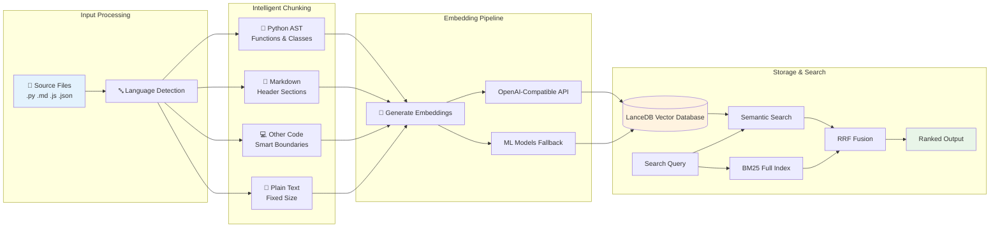

# FSS-Mini-RAG Technical Deep Dive

> **How the system actually works under the hood**  
> *For developers who want to understand, modify, and extend the implementation*

## Table of Contents

- [System Architecture](#system-architecture)
- [How Text Becomes Searchable](#how-text-becomes-searchable)
- [The Embedding Pipeline](#the-embedding-pipeline)
- [Chunking Strategies](#chunking-strategies)
- [Search Algorithm](#search-algorithm)
- [Performance Architecture](#performance-architecture)
- [Configuration System](#configuration-system)
- [Error Handling & Fallbacks](#error-handling--fallbacks)

## System Architecture

FSS-Mini-RAG implements a hybrid semantic search system with three core stages:


```mermaid
graph LR
    subgraph "Input Processing"
        Files[📁 Source Files<br/>.py .md .js .json]
        Language[🔤 Language Detection]
        Files --> Language
    end
    
    subgraph "Intelligent Chunking"
        Language --> Python[🐍 Python AST<br/>Functions & Classes]
        Language --> Markdown[📝 Markdown<br/>Header Sections]
        Language --> Code[💻 Other Code<br/>Smart Boundaries]
        Language --> Text[📄 Plain Text<br/>Fixed Size]
    end
    
    subgraph "Embedding Pipeline"
        Python --> Embed[🧠 Generate Embeddings]
        Markdown --> Embed
        Code --> Embed
        Text --> Embed
        
        Embed --> API[OpenAI-Compatible API]
        Embed --> ML[ML Models Fallback]
    end

    subgraph "Storage & Search"
        API --> Store[(LanceDB Vector Database)]
        ML --> Store

        Query[Search Query] --> Semantic[Semantic Search]
        Query --> BM25[BM25 Full Index]

        Store --> Semantic
        Semantic --> RRF[RRF Fusion]
        BM25 --> RRF
        RRF --> Ranked[Ranked Output]
    end
    
    style Files fill:#e3f2fd
    style Store fill:#fff3e0
    style Ranked fill:#e8f5e8
```

### Core Components

1. **ProjectIndexer** (`indexer.py`) - Orchestrates the indexing pipeline
2. **CodeChunker** (`chunker.py`) - Breaks files into meaningful pieces
3. **OllamaEmbedder** (`ollama_embeddings.py`) - Converts text to vectors via OpenAI-compatible API
4. **CodeSearcher** (`search.py`) - Finds and ranks relevant content
5. **FileWatcher** (`watcher.py`) - Monitors changes for incremental updates

## How Text Becomes Searchable

### Step 1: File Discovery and Filtering

The system scans directories recursively, applying these filters:
- **Supported extensions**: `.py`, `.js`, `.md`, `.json`, etc. (50+ types)
- **Size limits**: Skip files larger than 10MB (configurable)
- **Exclusion patterns**: Skip `node_modules`, `.git`, `__pycache__`, etc.
- **Binary detection**: Skip binary files automatically

### Step 2: Change Detection (Incremental Updates)

Before processing any file, the system checks if re-indexing is needed:

```python
def _needs_reindex(self, file_path: Path, manifest: Dict) -> bool:
    """Smart change detection to avoid unnecessary work."""
    file_info = manifest.get('files', {}).get(str(file_path))
    
    # Quick checks first (fast)
    current_size = file_path.stat().st_size
    current_mtime = file_path.stat().st_mtime
    
    if not file_info:
        return True  # New file
    
    if (file_info.get('size') != current_size or 
        file_info.get('mtime') != current_mtime):
        return True  # Size or time changed
    
    # Content hash check (slower, only when needed)
    if file_info.get('hash') != self._get_file_hash(file_path):
        return True  # Content actually changed
    
    return False  # File unchanged, skip processing
```

### Step 3: Streaming for Large Files

Files larger than 1MB are processed in chunks to avoid memory issues:

```python
def _read_file_streaming(self, file_path: Path) -> str:
    """Read large files in chunks to manage memory."""
    content_parts = []
    
    with open(file_path, 'r', encoding='utf-8', errors='ignore') as f:
        while True:
            chunk = f.read(8192)  # 8KB chunks
            if not chunk:
                break
            content_parts.append(chunk)
    
    return ''.join(content_parts)
```

## The Embedding Pipeline

### OpenAI-Compatible Endpoint (Default)

The system uses any OpenAI-compatible embedding API as the primary provider. This works with LM Studio, vLLM, OpenAI, or any compatible proxy.

On startup, the embedder:
1. Queries `GET /v1/models` to discover available models
2. Auto-selects the best embedding model (prefers MiniLM for precision, Nomic for conceptual depth)
3. Sends a test embedding request to verify the connection and detect dimension

```python
# Default: connects to LM Studio at localhost:1234
embedder = OllamaEmbedder()  # Auto-detects model

# Or specify explicitly
embedder = OllamaEmbedder(
    model_name="text-embedding-all-minilm-l6-v2-embedding",
    base_url="http://localhost:1234/v1"
)
```

**Embedding profiles** (set in config.yaml):
- `precision` (default): Prefers MiniLM (384 dim, 2x faster, better at literal code matching)
- `conceptual`: Prefers Nomic (768 dim, better at "why does X happen" questions)

**Fallback chain:** If the primary endpoint is unavailable, falls back to local ML models (sentence-transformers) if installed. If nothing is available, semantic search is disabled and BM25 keyword search runs solo.

The index stores which model was used (`manifest.json`). If you search with a different model than what was indexed, you get a warning to re-index.

### ML Fallback (Optional)

If `sentence-transformers` is installed, it serves as a fallback when no API endpoint is available:

```python
# Install optional ML support
pip install sentence-transformers torch
```

### Batch Processing for Efficiency

When processing multiple texts, the system batches requests:

```python
def embed_texts_batch(self, texts: List[str]) -> np.ndarray:
    """Process multiple texts efficiently with batching."""
    embeddings = []
    
    # Process in batches to manage memory and API limits
    batch_size = self.batch_size  # Default: 32
    
    for i in range(0, len(texts), batch_size):
        batch = texts[i:i + batch_size]
        
        if self.ollama_available:
            # Concurrent Ollama requests
            with ThreadPoolExecutor(max_workers=4) as executor:
                futures = [executor.submit(self._get_ollama_embedding, text) 
                          for text in batch]
                batch_embeddings = [f.result() for f in futures]
        else:
            # Sequential fallback processing
            batch_embeddings = [self.embed_text(text) for text in batch]
        
        embeddings.extend(batch_embeddings)
    
    return np.array(embeddings)
```

## Chunking Strategies

The system uses different chunking strategies based on file type and content:

### Python Files: AST-Based Chunking
```python
def chunk_python_file(self, content: str, file_path: str) -> List[CodeChunk]:
    """Parse Python files using AST for semantic boundaries."""
    try:
        tree = ast.parse(content)
        chunks = []
        
        for node in ast.walk(tree):
            if isinstance(node, (ast.FunctionDef, ast.AsyncFunctionDef)):
                # Extract function with context
                start_line = node.lineno
                end_line = getattr(node, 'end_lineno', start_line + 10)
                
                func_content = self._extract_lines(content, start_line, end_line)
                
                chunks.append(CodeChunk(
                    content=func_content,
                    file_path=file_path,
                    start_line=start_line,
                    end_line=end_line,
                    chunk_type='function',
                    name=node.name,
                    language='python'
                ))
                
            elif isinstance(node, ast.ClassDef):
                # Similar extraction for classes...
                
    except SyntaxError:
        # Fall back to fixed-size chunking for invalid Python
        return self.chunk_fixed_size(content, file_path)
```

### Markdown Files: Header-Based Chunking
```python
def chunk_markdown_file(self, content: str, file_path: str) -> List[CodeChunk]:
    """Split markdown on headers for logical sections."""
    lines = content.split('\n')
    chunks = []
    current_chunk = []
    current_header = None
    
    for line_num, line in enumerate(lines, 1):
        if line.startswith('#'):
            # New header found - save previous chunk
            if current_chunk:
                chunk_content = '\n'.join(current_chunk)
                chunks.append(CodeChunk(
                    content=chunk_content,
                    file_path=file_path,
                    start_line=line_num - len(current_chunk),
                    end_line=line_num - 1,
                    chunk_type='section',
                    name=current_header,
                    language='markdown'
                ))
                current_chunk = []
            
            current_header = line.strip('#').strip()
        
        current_chunk.append(line)
    
    # Don't forget the last chunk
    if current_chunk:
        # ... save final chunk
```

### Fixed-Size Chunking with Overlap
```python
def chunk_fixed_size(self, content: str, file_path: str) -> List[CodeChunk]:
    """Fallback chunking for unsupported file types."""
    chunks = []
    max_size = self.config.chunking.max_size  # Default: 2000 chars
    overlap = 200  # Character overlap between chunks
    
    for i in range(0, len(content), max_size - overlap):
        chunk_content = content[i:i + max_size]
        
        # Try to break at word boundaries
        if i + max_size < len(content):
            last_space = chunk_content.rfind(' ')
            if last_space > max_size * 0.8:  # Don't break too early
                chunk_content = chunk_content[:last_space]
        
        if len(chunk_content.strip()) >= self.config.chunking.min_size:
            chunks.append(CodeChunk(
                content=chunk_content.strip(),
                file_path=file_path,
                start_line=None,  # Unknown for fixed-size chunks
                end_line=None,
                chunk_type='text',
                name=None,
                language='text'
            ))
    
    return chunks
```

## Search Algorithm

### Hybrid Semantic + Keyword Search

The search runs two independent pipelines and merges results with Reciprocal Rank Fusion (RRF). This ensures keyword matches are found even when embeddings are poor, and semantic matches are found even when keywords don't match exactly.

```
Query -> [Semantic Pipeline] -> ranked results by cosine similarity
      -> [BM25 Pipeline]    -> ranked results by term frequency (full index)
      -> [RRF Fusion]       -> merged by rank position
      -> [Smart Rerank]     -> minor boosts for important files
      -> [Diversity Filter] -> prevent one file dominating
      -> [Consolidation]    -> merge adjacent chunks from same file
```

**Reciprocal Rank Fusion (RRF):**
```python
# For each result appearing in any pipeline:
rrf_score = sum(1 / (60 + rank_in_method)) for each method
# Results appearing in BOTH methods score highest
```

**BM25 tokenizer** splits code identifiers for better matching:
- `snake_case_function` -> `[snake_case_function, snake, case, function]`
- `CamelCaseClass` -> `[camelcaseclass, camel, case, class]`
- Searching "auth" matches `getAuthManager` and `auth_handler`

**Score labels** auto-detect the scoring scale (RRF vs cosine) and display human-readable quality indicators (HIGH/GOOD/FAIR/LOW/WEAK) next to each result.

If no embedding provider is available, semantic search is skipped and BM25 runs solo (honest degradation, no fake embeddings).

### Vector Database Operations

Storage and retrieval using LanceDB:

```python
def _create_vector_table(self, chunks: List[CodeChunk], embeddings: np.ndarray):
    """Create LanceDB table with vectors and metadata."""
    
    # Prepare data for LanceDB
    data = []
    for chunk, embedding in zip(chunks, embeddings):
        data.append({
            'vector': embedding.tolist(),  # LanceDB requires lists
            'content': chunk.content,
            'file_path': str(chunk.file_path),
            'start_line': chunk.start_line or 0,
            'end_line': chunk.end_line or 0,
            'chunk_type': chunk.chunk_type,
            'name': chunk.name or '',
            'language': chunk.language,
            'created_at': datetime.now().isoformat()
        })
    
    # Create table with vector index
    table = self.db.create_table("chunks", data, mode="overwrite")
    
    # Add vector index for fast similarity search
    table.create_index("vector", metric="cosine")
    
    return table

def vector_search(self, query_embedding: np.ndarray, top_k: int) -> List[SearchResult]:
    """Fast vector similarity search."""
    table = self.db.open_table("chunks")
    
    # LanceDB vector search
    results = (table
               .search(query_embedding.tolist())
               .limit(limit)
               .to_pandas())
    
    search_results = []
    for _, row in results.iterrows():
        search_results.append(SearchResult(
            content=row['content'],
            file_path=Path(row['file_path']),
            similarity_score=1.0 - row['_distance'],  # Convert distance to similarity
            start_line=row['start_line'] if row['start_line'] > 0 else None,
            end_line=row['end_line'] if row['end_line'] > 0 else None,
            chunk_type=row['chunk_type'],
            name=row['name'] if row['name'] else None
        ))
    
    return search_results
```

## Performance Architecture

### Memory Management

The system is designed to handle large codebases efficiently:

```python
class MemoryEfficientIndexer:
    """Streaming indexer that processes files without loading everything into memory."""
    
    def __init__(self, max_memory_mb: int = 500):
        self.max_memory_mb = max_memory_mb
        self.current_batch = []
        self.batch_size_bytes = 0
        
    def process_file_batch(self, files: List[Path]):
        """Process files in memory-efficient batches."""
        for file_path in files:
            file_size = file_path.stat().st_size
            
            # Check if adding this file would exceed memory limit
            if (self.batch_size_bytes + file_size > 
                self.max_memory_mb * 1024 * 1024):
                
                # Process current batch and start new one
                self._process_current_batch()
                self._clear_batch()
            
            self.current_batch.append(file_path)
            self.batch_size_bytes += file_size
        
        # Process remaining files
        if self.current_batch:
            self._process_current_batch()
```

### Concurrent Processing

Multiple files are processed in parallel:

```python
def index_files_parallel(self, file_paths: List[Path]) -> List[CodeChunk]:
    """Process multiple files concurrently."""
    all_chunks = []
    
    # Determine optimal worker count based on CPU and file count
    max_workers = min(4, len(file_paths), os.cpu_count() or 1)
    
    with ThreadPoolExecutor(max_workers=max_workers) as executor:
        # Submit all files for processing
        future_to_file = {
            executor.submit(self._process_single_file, file_path): file_path
            for file_path in file_paths
        }
        
        # Collect results as they complete
        for future in as_completed(future_to_file):
            file_path = future_to_file[future]
            try:
                chunks = future.result()
                all_chunks.extend(chunks)
                
                # Update progress
                self._update_progress(file_path)
                
            except Exception as e:
                logger.error(f"Failed to process {file_path}: {e}")
                self.failed_files.append(file_path)
    
    return all_chunks
```

### Database Optimization

LanceDB is optimized for vector operations:

```python
def optimize_database(self):
    """Optimize database for search performance."""
    table = self.db.open_table("chunks")
    
    # Compact the table to remove deleted rows
    table.compact_files()
    
    # Rebuild vector index for optimal performance
    table.create_index("vector", 
                      metric="cosine",
                      num_partitions=256,  # Optimize for dataset size
                      num_sub_vectors=96)  # Balance speed vs accuracy
    
    # Add secondary indexes for filtering
    table.create_index("file_path")
    table.create_index("chunk_type")
    table.create_index("language")
```

## Configuration System

### Hierarchical Configuration

Configuration is loaded from multiple sources with precedence:

```python
def load_configuration(self, project_path: Path) -> RAGConfig:
    """Load configuration with hierarchical precedence."""
    
    # 1. Start with system defaults
    config = RAGConfig()  # Built-in defaults
    
    # 2. Apply global user config if it exists
    global_config_path = Path.home() / '.config' / 'fss-mini-rag' / 'config.yaml'
    if global_config_path.exists():
        global_config = self._load_yaml_config(global_config_path)
        config = self._merge_configs(config, global_config)
    
    # 3. Apply project-specific config
    project_config_path = project_path / '.mini-rag' / 'config.yaml'
    if project_config_path.exists():
        project_config = self._load_yaml_config(project_config_path)
        config = self._merge_configs(config, project_config)
    
    # 4. Apply environment variable overrides
    config = self._apply_env_overrides(config)
    
    return config
```

### Auto-Optimization

The system analyzes projects and suggests optimizations:

```python
class ProjectAnalyzer:
    """Analyzes project characteristics to suggest optimal configuration."""
    
    def analyze_project(self, project_path: Path) -> Dict[str, Any]:
        """Analyze project structure and content patterns."""
        analysis = {
            'total_files': 0,
            'languages': Counter(),
            'file_sizes': [],
            'avg_function_length': 0,
            'documentation_ratio': 0.0
        }
        
        for file_path in project_path.rglob('*'):
            if not file_path.is_file():
                continue
                
            analysis['total_files'] += 1
            
            # Detect language from extension
            language = self._detect_language(file_path)
            analysis['languages'][language] += 1
            
            # Analyze file size
            size = file_path.stat().st_size
            analysis['file_sizes'].append(size)
            
            # Analyze content patterns for supported languages
            if language == 'python':
                func_lengths = self._analyze_python_functions(file_path)
                analysis['avg_function_length'] = np.mean(func_lengths)
        
        return analysis
    
    def generate_recommendations(self, analysis: Dict[str, Any]) -> RAGConfig:
        """Generate optimal configuration based on analysis."""
        config = RAGConfig()
        
        # Adjust chunk size based on average function length
        if analysis['avg_function_length'] > 0:
            # Make chunks large enough to contain average function
            optimal_chunk_size = min(4000, int(analysis['avg_function_length'] * 1.5))
            config.chunking.max_size = optimal_chunk_size
        
        # Adjust streaming threshold based on project size
        if analysis['total_files'] > 1000:
            # Use streaming for smaller files in large projects
            config.streaming.threshold_bytes = 512 * 1024  # 512KB
        
        # Optimize for dominant language
        dominant_language = analysis['languages'].most_common(1)[0][0]
        if dominant_language == 'python':
            config.chunking.strategy = 'semantic'  # Use AST parsing
        elif dominant_language in ['markdown', 'text']:
            config.chunking.strategy = 'header'    # Use header-based
        
        return config
```

## Error Handling & Fallbacks

### Graceful Degradation

The system continues working even when components fail:

```python
class RobustIndexer:
    """Indexer with comprehensive error handling and recovery."""
    
    def index_project_with_recovery(self, project_path: Path) -> Dict[str, Any]:
        """Index project with automatic error recovery."""
        results = {
            'files_processed': 0,
            'files_failed': 0,
            'chunks_created': 0,
            'errors': [],
            'fallbacks_used': []
        }
        
        try:
            # Primary indexing path
            return self._index_project_primary(project_path)
            
        except DatabaseCorruptionError as e:
            # Database corrupted - rebuild from scratch
            logger.warning(f"Database corruption detected: {e}")
            self._rebuild_database(project_path)
            results['fallbacks_used'].append('database_rebuild')
            return self._index_project_primary(project_path)
            
        except EmbeddingServiceError as e:
            # Embedding service failed - try fallback
            logger.warning(f"Primary embedding service failed: {e}")
            self.embedder.force_fallback_mode()
            results['fallbacks_used'].append('embedding_fallback')
            return self._index_project_primary(project_path)
            
        except InsufficientMemoryError as e:
            # Out of memory - switch to streaming mode
            logger.warning(f"Memory limit exceeded: {e}")
            self.config.streaming.enabled = True
            self.config.streaming.threshold_bytes = 100 * 1024  # 100KB
            results['fallbacks_used'].append('streaming_mode')
            return self._index_project_primary(project_path)
            
        except Exception as e:
            # Unknown error - attempt minimal indexing
            logger.error(f"Unexpected error during indexing: {e}")
            results['errors'].append(str(e))
            return self._index_project_minimal(project_path, results)
    
    def _index_project_minimal(self, project_path: Path, results: Dict) -> Dict:
        """Minimal indexing mode that processes files individually."""
        # Process files one by one with individual error handling
        for file_path in self._discover_files(project_path):
            try:
                chunks = self._process_single_file_safe(file_path)
                results['chunks_created'] += len(chunks)
                results['files_processed'] += 1
                
            except Exception as e:
                logger.debug(f"Failed to process {file_path}: {e}")
                results['files_failed'] += 1
                results['errors'].append(f"{file_path}: {e}")
        
        return results
```

### Validation and Recovery

The system validates data integrity and can recover from corruption:

```python
def validate_index_integrity(self, project_path: Path) -> bool:
    """Validate that the index is consistent and complete."""
    try:
        rag_dir = project_path / '.mini-rag'
        
        # Check required files exist
        required_files = ['manifest.json', 'database.lance']
        for filename in required_files:
            if not (rag_dir / filename).exists():
                raise IntegrityError(f"Missing required file: {filename}")
        
        # Validate manifest structure
        with open(rag_dir / 'manifest.json') as f:
            manifest = json.load(f)
            
        required_keys = ['file_count', 'chunk_count', 'indexed_at']
        for key in required_keys:
            if key not in manifest:
                raise IntegrityError(f"Missing manifest key: {key}")
        
        # Validate database accessibility
        db = lancedb.connect(rag_dir / 'database.lance')
        table = db.open_table('chunks')
        
        # Quick consistency check
        chunk_count_db = table.count_rows()
        chunk_count_manifest = manifest['chunk_count']
        
        if abs(chunk_count_db - chunk_count_manifest) > 0.1 * chunk_count_manifest:
            raise IntegrityError(f"Chunk count mismatch: DB={chunk_count_db}, Manifest={chunk_count_manifest}")
        
        return True
        
    except Exception as e:
        logger.error(f"Index integrity validation failed: {e}")
        return False

def repair_index(self, project_path: Path) -> bool:
    """Attempt to repair a corrupted index."""
    try:
        rag_dir = project_path / '.mini-rag'
        
        # Create backup of existing index
        backup_dir = rag_dir.parent / f'.mini-rag-backup-{int(time.time())}'
        shutil.copytree(rag_dir, backup_dir)
        
        # Attempt repair operations
        if (rag_dir / 'database.lance').exists():
            # Try to rebuild manifest from database
            db = lancedb.connect(rag_dir / 'database.lance')
            table = db.open_table('chunks')
            
            # Reconstruct manifest
            manifest = {
                'chunk_count': table.count_rows(),
                'file_count': len(set(table.to_pandas()['file_path'])),
                'indexed_at': datetime.now().isoformat(),
                'repaired_at': datetime.now().isoformat(),
                'backup_location': str(backup_dir)
            }
            
            with open(rag_dir / 'manifest.json', 'w') as f:
                json.dump(manifest, f, indent=2)
            
            logger.info(f"Index repaired successfully. Backup saved to {backup_dir}")
            return True
        else:
            # Database missing - need full rebuild
            logger.warning("Database missing - full rebuild required")
            return False
            
    except Exception as e:
        logger.error(f"Index repair failed: {e}")
        return False
```

## LLM Model Selection & Performance

### Model Recommendations by Use Case

FSS-Mini-RAG works well with various LLM sizes because our rich context and guided prompts help small models perform excellently:

**Recommended (Best Balance):**
- **qwen3:1.7b** - Excellent quality with fast performance (default priority)
- **qwen3:0.6b** - Surprisingly good for CPU-only systems (522MB)

**Still Excellent (Slower but highest quality):**
- **qwen3:4b** - Highest quality, slower responses
- **qwen3:4b:q8_0** - High-precision quantized version for production

### Why Small Models Work Well Here

Small models can produce excellent results in RAG systems because:

1. **Rich Context**: Our chunking provides substantial context around each match
2. **Guided Prompts**: Well-structured prompts give models a clear "runway" to continue
3. **Specific Domain**: Code analysis is more predictable than general conversation

Without good context, small models tend to get lost and produce erratic output. But with RAG's rich context and focused prompts, even the 0.6B model can provide meaningful analysis.

### Quantization Benefits

For production deployments, consider quantized models like `qwen3:1.7b:q8_0` or `qwen3:4b:q8_0`:
- **Q8_0**: 8-bit quantization with minimal quality loss
- **Smaller memory footprint**: ~50% reduction vs full precision
- **Better CPU performance**: Faster inference on CPU-only systems
- **Production ready**: Maintains analysis quality while improving efficiency

This technical guide provides the deep implementation details that developers need to understand, modify, and extend the system, while keeping the main README focused on getting users started quickly.