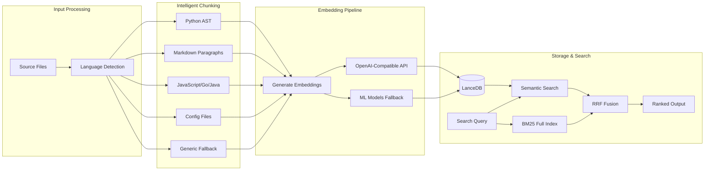

# FSS-Mini-RAG Technical Deep Dive

> **How the system actually works under the hood**
> *For developers who want to understand, modify, and extend the implementation*

## Table of Contents

- [System Architecture](#system-architecture)
- [Core Components](#core-components)
- [Chunking Pipeline](#chunking-pipeline)
- [Embedding System](#embedding-system)
- [Search Pipeline](#search-pipeline)
- [Indexing Engine](#indexing-engine)
- [Web Research Pipeline](#web-research-pipeline)
- [Configuration System](#configuration-system)
- [Desktop GUI](#desktop-gui)

## System Architecture

FSS-Mini-RAG implements a hybrid semantic search system with three core stages:


```mermaid
graph LR
    subgraph "Input Processing"
        Files[Source Files] --> Language[Language Detection]
    end

    subgraph "Intelligent Chunking"
        Language --> Python[Python AST]
        Language --> Markdown[Markdown Paragraphs]
        Language --> JS[JavaScript/Go/Java]
        Language --> Config[Config Files]
        Language --> Generic[Generic Fallback]
    end

    subgraph "Embedding Pipeline"
        Python --> Embed[Generate Embeddings]
        Markdown --> Embed
        JS --> Embed
        Config --> Embed
        Generic --> Embed
        Embed --> API[OpenAI-Compatible API]
        Embed --> ML[ML Models Fallback]
    end

    subgraph "Storage & Search"
        API --> Store[(LanceDB)]
        ML --> Store

        Query[Search Query] --> Semantic[Semantic Search]
        Query --> BM25[BM25 Full Index]

        Store --> Semantic
        Semantic --> RRF[RRF Fusion]
        BM25 --> RRF
        RRF --> Ranked[Ranked Output]
    end
```

### Core Components

1. **ProjectIndexer** (`indexer.py`) — Parallel indexing with cancellation, progress reporting, and manifest tracking
2. **CodeChunker** (`chunker.py`) — Language-aware chunking with AST parsing, paragraph splitting, and file overviews
3. **OllamaEmbedder** (`ollama_embeddings.py`) — OpenAI-compatible embedding provider with auto-detection and ML fallback
4. **CodeSearcher** (`search.py`) — Independent BM25 + semantic search with RRF fusion
5. **LLMSynthesizer** (`llm_synthesizer.py`) — LLM synthesis with streaming SSE support
6. **DeepResearchEngine** (`deep_research.py`) — Iterative web research with time budgets and corpus pruning
7. **MiniWebScraper** (`web_scraper.py`) — Rate-limited web fetcher with robots.txt compliance
8. **SearchEngineManager** (`search_engines.py`) — DuckDuckGo/Tavily/Brave unified interface
9. **ContentExtractors** (`extractors.py`) — HTML, PDF, arXiv, GitHub content extraction
10. **RateLimiter** (`rate_limiter.py`) — Retry infrastructure with backoff for all API calls
11. **NonInvasiveFileWatcher** (`non_invasive_watcher.py`) — Monitors changes for incremental updates

---

## Chunking Pipeline

Source: `mini_rag/chunker.py` — class `CodeChunker`

The chunker breaks files into semantically meaningful pieces. Language is detected from the file extension, then a language-specific strategy is applied.

### Language Detection

The chunker maps file extensions to languages:

```python
# From chunker.py — self.language_patterns
".py"  -> "python"      ".md"   -> "markdown"    ".json" -> "json"
".js"  -> "javascript"  ".txt"  -> "text"        ".yaml" -> "yaml"
".ts"  -> "typescript"  ".go"   -> "go"          ".toml" -> "toml"
".java" -> "java"       ".rs"   -> "rust"        # ... 30+ extensions
```

### Per-Language Size Configs

Each language has tuned chunk sizes (from `DEFAULT_LANGUAGE_CONFIGS`):

| Language | Max Size | Min Size | Notes |
|----------|----------|----------|-------|
| Python | 3000 | 200 | AST-based |
| JavaScript/TypeScript | 2500 | 150 | Regex-based function detection |
| Go / Java | 2500-3000 | 150-200 | Regex-based |
| Markdown | 2500 | 300 | Paragraph-based |
| JSON | 1000 | 50 | Max file size: 50KB |
| YAML / Bash | 1500 | 100 | |
| Text | 2000 | 200 | Fixed-size fallback |

### Chunking Strategies

The `chunk_file` method dispatches to a language-specific chunker:

```python
# From chunker.py:261-281 — strategy dispatch
if language == "python":
    chunks = self._chunk_python(content, str(file_path))
elif language in ["javascript", "typescript"]:
    chunks = self._chunk_javascript(content, str(file_path), language)
elif language == "go":
    chunks = self._chunk_go(content, str(file_path))
elif language == "java":
    chunks = self._chunk_java(content, str(file_path))
elif language in ["markdown", "text", "restructuredtext", "asciidoc"]:
    chunks = self._chunk_markdown(content, str(file_path), language)
elif language in ["json", "yaml", "toml", "ini", "xml", "config"]:
    chunks = self._chunk_config(content, str(file_path), language)
else:
    chunks = self._chunk_generic(content, str(file_path), language)
```

**Python (`_chunk_python`)**: Uses `ast.parse()` to extract functions, classes, methods, and module-level code. Each AST node becomes a chunk with accurate line numbers. Falls back to generic chunking on `SyntaxError`.

**Markdown (`_chunk_markdown`)**: Paragraph-based splitting that preserves code blocks (fenced ``` blocks are never split mid-block) and header hierarchy. Section boundaries are respected.

**Config files (`_chunk_config`)**: Smaller chunks for JSON/YAML/TOML. Large JSON files (>50KB) are skipped entirely.

**Generic (`_chunk_generic`)**: Fixed-size chunking with overlap. Breaks at line boundaries, avoids splitting mid-line.

### Post-Processing

After chunking, two things happen:

1. **Size enforcement** (`_enforce_size_constraints`): Chunks exceeding `max_size` are split further. Chunks below `min_size` are discarded or merged.

2. **File overview chunk** (`_create_file_overview`): A special chunk is prepended listing all functions and classes in the file. This handles "what's in this file?" queries.

### CodeChunk Data Model

Each chunk carries rich metadata:

```python
# From chunker.py — CodeChunk fields
content: str           # The actual text
file_path: str         # Relative path
start_line: int        # First line number
end_line: int          # Last line number
chunk_type: str        # 'function', 'class', 'method', 'module', 'module_header'
name: str              # Function/class name (if applicable)
language: str          # Detected language
parent_class: str      # Enclosing class (for methods)
chunk_index: int       # Position in file
total_chunks: int      # Total chunks from this file
prev_chunk_id: str     # Linked-list navigation
next_chunk_id: str     # Linked-list navigation
```

---

## Embedding System

Source: `mini_rag/ollama_embeddings.py` — class `OllamaEmbedder`

Despite the legacy class name, this module supports any OpenAI-compatible embedding endpoint.

### Provider Priority Chain

```
1. OpenAI-compatible endpoint (LM Studio, vLLM, OpenAI, any proxy)
   ↓ if unavailable
2. ML fallback (sentence-transformers, if installed)
   ↓ if unavailable
3. Mode: "unavailable" — semantic search skipped, BM25 only
```

There are no fake embeddings. If nothing is available, the system says so honestly and runs keyword search only.

### Auto-Detection

When `model_name="auto"`, the embedder:

1. Queries `GET /v1/models` (OpenAI) or `GET /api/tags` (legacy) to discover available models
2. Classifies models as embedding or LLM based on name patterns (`embed`, `bge-`, `e5-`, `gte-`)
3. Excludes multimodal/VL models from auto-selection
4. Selects based on the configured profile:

| Profile | Selection Order | Best For |
|---------|----------------|----------|
| `precision` | MiniLM > Granite > Nomic | Literal code matching, fast |
| `conceptual` | Nomic > BGE > E5 > MiniLM | Semantic depth, "why" queries |

### Embedding Modes

```python
# From ollama_embeddings.py — self.mode values
"openai"      # Connected to OpenAI-compatible endpoint
"ollama"      # Connected to Ollama native API
"fallback"    # Using local ML models (sentence-transformers)
"unavailable" # Nothing available — BM25 only
```

### Manifest Tracking

The index manifest stores which model was used for embedding. If you search with a different model than what was indexed, the system warns you to re-index.

---

## Search Pipeline

Source: `mini_rag/search.py` — class `CodeSearcher`

The search runs a **two-retriever hybrid** approach adapted from the FSS-RAG architecture.

### Pipeline Overview

```
Query
  |
  v
[Query Expansion] ---- optional LLM-based synonym expansion
  |
  +---> [Semantic Search]  (LanceDB vector similarity, top_k*3)
  |           |
  +---> [BM25 Search]      (BM25Okapi full index, top_k*3)
  |           |
  v           v
  +-----+-----+
        |
  [RRF Fusion]  ---- merge by rank, not score
        |
  [Smart Re-rank] ---- boost by file importance, recency, chunk type
        |
  [Diversity Filter] ---- max 2 per file, type diversity, dedup
        |
  [Chunk Consolidation] ---- merge adjacent chunks from same file
        |
        v
    Final Results
```

### Stage 1: Query Expansion (optional)

Source: `mini_rag/query_expander.py`

When `config.search.expand_queries = true`, the query is sent to an LLM which adds synonym/related terms. Results are cached per-query. Disabled by default in CLI.

### Stage 2a: Semantic Search

Source: `search.py:497-521`

Uses LanceDB's built-in vector search. The query is embedded using the same model that built the index.

```python
# From search.py:508-518 — actual code
results_df = (
    self.table.search(query_embedding)
    .limit(top_k * 3)
    .to_pandas()
)

for _, row in results_df.iterrows():
    distance = row["_distance"]
    score = 1 / (1 + distance)  # Convert L2 distance to 0-1 similarity
```

Skipped entirely if embedder mode is `"unavailable"` — falls back to BM25-only.

### Stage 2b: BM25 Keyword Search

Source: `search.py:356-386`

Uses `rank_bm25.BM25Okapi` over the full chunk corpus.

**Code-aware tokenizer** (`_tokenize_for_bm25`, `search.py:25-58`):

```python
# From search.py — actual tokenization logic
# Splits on: whitespace, non-alphanumeric, snake_case, camelCase
# "get_auth_token" -> ["get_auth_token", "get", "auth", "token"]
# "getAuthToken"   -> ["getauthtoken", "get", "auth", "token"]
```

The original compound token is kept alongside split parts so exact matches still work.

### Stage 3: RRF Fusion

Source: `search.py:390-452`

Reciprocal Rank Fusion merges the two ranked lists using rank position rather than raw scores. This avoids the calibration problem of mixing BM25 scores (unbounded) with cosine similarity (0-1).

```
RRF_score = sum( 1 / (k + rank + 1) )  for each list containing this result
```

- **k = 60** (standard constant from the original RRF paper, Cormack et al. 2009)
- Results appearing in both lists score highest
- Deduplication by `(file_path, start_line, end_line)`
- Typical score range: 0.01 - 0.05

### Stage 4: Smart Re-ranking

Source: `search.py:622-678`

Post-fusion score adjustments (multiplicative boosts):

| Condition | Boost | Rationale |
|-----------|-------|-----------|
| Important file patterns (`readme`, `main.`, `__init__`, `config`) | x1.05 | Core files are usually more relevant |
| Modified in last 7 days | x1.02 | Recently touched code |
| Chunk type is `function`, `class`, or `method` | x1.10 | Code definitions > raw blocks |
| Chunk type is `comment` or `docstring` | x1.05 | Documentation helps understanding |
| Content has 3+ substantive lines | x1.02 | Well-structured content |
| Content < 50 characters | x0.90 | Penalty: too short to be useful |

### Stage 5: Diversity Constraints

- **Max 2 chunks per file** — prevents one large file from dominating
- **Chunk type diversity** — limits any single type to max 1/3 of results
- **Content deduplication** — hashes first 200 chars, skips duplicates

### Stage 6: Chunk Consolidation

Source: `search.py:561-620`

Merges adjacent/overlapping chunks from the same file into contiguous passages. Groups by file path, sorts by start line, merges where the gap is <= 1 line.

### Score Labels

The display system auto-detects the RRF score scale:

| Score Range | Label |
|-------------|-------|
| >= 0.035 | HIGH |
| >= 0.025 | GOOD |
| >= 0.018 | FAIR |
| >= 0.010 | LOW |
| < 0.010 | WEAK |

---

## Indexing Engine

Source: `mini_rag/indexer.py` — class `ProjectIndexer`

### File Discovery

The indexer scans the project directory recursively with:

- **Include patterns**: 40+ file extensions — `.py`, `.js`, `.md`, `.json`, `.yaml`, etc. plus extensionless files like `README`, `LICENSE`
- **Exclude patterns**: `__pycache__`, `.git`, `.mini-rag`, `node_modules`, `.venv`, `dist`, `build`, `*.pyc`, `*.so`, `*.log`, etc.
- **Max file size**: 50MB (configurable)

### Incremental Indexing

The `_needs_reindex` method checks each file against the manifest:

1. **New file?** → Index it
2. **Size or mtime changed?** → Re-index
3. **Content hash (SHA-256) changed?** → Re-index (slower check, only when mtime differs)
4. **File unchanged?** → Skip

### Parallel Processing

Files are processed in parallel using `ThreadPoolExecutor`:

```python
# From indexer.py:910-914 — actual parallel processing
with ThreadPoolExecutor(max_workers=self.max_workers) as executor:
    future_to_file = {
        executor.submit(self._process_file, file_path): file_path
        for file_path in files_to_index
    }
```

Default: 4 workers. Each file is chunked, embedded, and added to LanceDB independently.

### Cancellation Support

The indexer supports cancellation via `threading.Event`. The GUI uses this to provide a cancel button during indexing. When cancelled, remaining futures are cancelled and partial results are preserved.

### Progress Reporting

A callback system (`_progress_callback`) reports `(files_done, files_total, chunks_so_far)` for GUI progress bars.

### Storage

Data is stored in LanceDB (embedded vector database) at `.mini-rag/`:

- `lance/` — vector database files
- `manifest.json` — file hashes, chunk counts, embedding model info
- `config.json` — indexer-specific configuration

---

## Web Research Pipeline

### Web Scraper

Source: `mini_rag/web_scraper.py` — class `MiniWebScraper`

A lightweight scraper using `requests` (no Playwright). Features:
- Rate limiting with per-domain tracking
- robots.txt compliance
- Session management with 3-bucket directory structure: `sources/`, `notes/`, `agent-notes/`

### Content Extractors

Source: `mini_rag/extractors.py`

| Extractor | Input | Method |
|-----------|-------|--------|
| HTML | Web pages | BeautifulSoup — strips nav/footer/ads, extracts article content |
| PDF | PDF files | pymupdf — page-by-page text extraction |
| arXiv | arXiv URLs | Fetches abstract + PDF, extracts structured content |
| GitHub | GitHub URLs | Fetches README, file contents via raw URLs |

### Search Engines

Source: `mini_rag/search_engines.py`

| Engine | Auth Required | Method |
|--------|---------------|--------|
| DuckDuckGo | No | HTML scraping with fallback (no API key needed) |
| Tavily | Yes (API key) | REST API |
| Brave | Yes (API key) | REST API |

### Deep Research Engine

Source: `mini_rag/deep_research.py` — class `DeepResearchEngine`

Iterative research cycles with time budgets:

```
ANALYZE → SEARCH → SCRAPE → PRUNE → REPORT → (repeat if time remains)
```

1. **Analyze**: LLM reads current corpus, identifies knowledge gaps
2. **Search**: Generates new queries from gaps, searches the web
3. **Scrape**: Fetches and extracts content from results
4. **Prune**: Trigram fuzzy deduplication, keyword overlap for corroboration scoring
5. **Report**: Generates comprehensive research report

Features:
- `SessionMetrics` analytics layer tracking file records, round history
- Time budget enforcement (e.g. `--time 1h`)
- Live progress visibility during rounds
- Corpus pruning to keep quality high

### Rate Limiter

Source: `mini_rag/rate_limiter.py`

Global retry infrastructure used by all API calls:
- Exponential backoff with jitter
- Per-domain rate limiting
- Configurable max retries and base delay

---

## Configuration System

Source: `mini_rag/config.py`

Configuration uses Python dataclasses with YAML persistence.

### Dataclass Hierarchy

```python
@dataclass RAGConfig          # Top-level config
  ├── ChunkingConfig          # max_size, min_size, strategy
  ├── EmbeddingConfig         # provider, base_url, model, profile, api_key
  ├── StreamingConfig         # enabled, threshold_bytes
  ├── FilesConfig             # min_file_size, exclude_patterns
  ├── SearchConfig            # default_top_k, enable_bm25, expand_queries
  ├── LLMConfig               # provider, api_base, synthesis_model, temperature
  └── DeepResearchConfig      # time_budget, max_rounds, search_engine
```

### Configuration Sources

1. **Built-in defaults** — hardcoded in dataclass definitions
2. **Project config** — `.mini-rag/config.yaml` (created on first run)
3. **GUI config** — `~/.config/fss-mini-rag/gui_config.json` (GUI-specific settings)

### Key Defaults

| Setting | Default | Source |
|---------|---------|--------|
| `embedding.provider` | `"openai"` | `EmbeddingConfig` |
| `embedding.base_url` | `"http://localhost:1234/v1"` | `EmbeddingConfig` |
| `embedding.model` | `"auto"` | `EmbeddingConfig` |
| `embedding.profile` | `"precision"` | `EmbeddingConfig` |
| `chunking.max_size` | `2000` | `ChunkingConfig` |
| `chunking.min_size` | `150` | `ChunkingConfig` |
| `search.default_top_k` | `10` | `SearchConfig` |
| `search.enable_bm25` | `true` | `SearchConfig` |

---

## Desktop GUI

Source: `mini_rag/gui/`

Tkinter application with Sun Valley theme (dark/light). Two-tab layout:

### Architecture

```
gui/
  app.py                    — Main application, ttk.Notebook with 2 tabs
  config_store.py           — GUI settings persistence (~/.config/fss-mini-rag/)
  tooltip.py                — Tooltip widget
  components/
    search_bar.py           — Search input with synthesis toggle
    results_table.py        — Treeview with score labels and chunk types
    content_panel.py        — Content viewer using RenderedMarkdown
    collection_panel.py     — Project browser with index/re-index buttons
    status_bar.py           — Connection status, timing, progress
    rendered_markdown.py    — Rich markdown rendering widget
    research_tab.py         — Web research tab (search, scrape, deep research)
  dialogs/
    about.py                — About dialog
    preferences.py          — Endpoint configuration with presets and Test Connection
  services/
    research.py             — Web research service layer
    streaming.py            — SSE streaming for live LLM token rendering
```

### EventBus

Components communicate via a publish/subscribe EventBus. This keeps components decoupled — the SearchBar doesn't know about the ResultsTable, it just publishes a `search_complete` event.

### RenderedMarkdown Widget

A custom Tk Text widget that renders markdown as rich text:
- Strips markdown syntax for clean display
- Code blocks rendered as embedded syntax-highlighted widgets
- Tables rendered as Treeview widgets
- Clickable links (opens browser)
- Collapsible thinking blocks (for LLM reasoning output)

### LLM Streaming

Uses Server-Sent Events (SSE) to stream tokens from the LLM endpoint. Tokens are rendered live in the RenderedMarkdown widget as they arrive.
