# FSS-Mini-RAG Technical Deep Dive

> **How the system actually works under the hood**  
> *For developers who want to understand, modify, and extend the implementation*

## Table of Contents

- [System Architecture](#system-architecture)
- [How Text Becomes Searchable](#how-text-becomes-searchable)
- [The Embedding Pipeline](#the-embedding-pipeline)
- [Chunking Strategies](#chunking-strategies)
- [Search Algorithm](#search-algorithm)
- [Performance Architecture](#performance-architecture)
- [Configuration System](#configuration-system)
- [Error Handling & Fallbacks](#error-handling--fallbacks)

## System Architecture

FSS-Mini-RAG implements a hybrid semantic search system with three core stages:

```mermaid
graph LR
    subgraph "Input Processing"
        Files[📁 Source Files<br/>.py .md .js .json]
        Language[🔤 Language Detection]
        Files --> Language
    end
    
    subgraph "Intelligent Chunking"
        Language --> Python[🐍 Python AST<br/>Functions & Classes]
        Language --> Markdown[📝 Markdown<br/>Header Sections]
        Language --> Code[💻 Other Code<br/>Smart Boundaries]
        Language --> Text[📄 Plain Text<br/>Fixed Size]
    end
    
    subgraph "Embedding Pipeline"
        Python --> Embed[🧠 Generate Embeddings]
        Markdown --> Embed
        Code --> Embed
        Text --> Embed
        
        Embed --> Ollama[🤖 Ollama API]
        Embed --> ML[🧠 ML Models] 
        Embed --> Hash[#️⃣ Hash Fallback]
    end
    
    subgraph "Storage & Search"
        Ollama --> Store[(💾 LanceDB<br/>Vector Database)]
        ML --> Store
        Hash --> Store
        
        Query[❓ Search Query] --> Vector[🎯 Vector Search]
        Query --> Keyword[🔤 BM25 Search]
        
        Store --> Vector
        Vector --> Hybrid[🔄 Hybrid Results]
        Keyword --> Hybrid
        Hybrid --> Ranked[📊 Ranked Output]
    end
    
    style Files fill:#e3f2fd
    style Store fill:#fff3e0
    style Ranked fill:#e8f5e8
```



### Core Components

1. **ProjectIndexer** (`indexer.py`) - Orchestrates the indexing pipeline
2. **CodeChunker** (`chunker.py`) - Breaks files into meaningful pieces
3. **OllamaEmbedder** (`ollama_embeddings.py`) - Converts text to vectors
4. **CodeSearcher** (`search.py`) - Finds and ranks relevant content
5. **FileWatcher** (`watcher.py`) - Monitors changes for incremental updates

## How Text Becomes Searchable

### Step 1: File Discovery and Filtering

The system scans directories recursively, applying these filters:
- **Supported extensions**: `.py`, `.js`, `.md`, `.json`, etc. (50+ types)
- **Size limits**: Skip files larger than 10MB (configurable)
- **Exclusion patterns**: Skip `node_modules`, `.git`, `__pycache__`, etc.
- **Binary detection**: Skip binary files automatically

### Step 2: Change Detection (Incremental Updates)

Before processing any file, the system checks if re-indexing is needed:

```python
def _needs_reindex(self, file_path: Path, manifest: Dict) -> bool:
    """Smart change detection to avoid unnecessary work."""
    file_info = manifest.get('files', {}).get(str(file_path))
    
    # Quick checks first (fast)
    current_size = file_path.stat().st_size
    current_mtime = file_path.stat().st_mtime
    
    if not file_info:
        return True  # New file
    
    if (file_info.get('size') != current_size or 
        file_info.get('mtime') != current_mtime):
        return True  # Size or time changed
    
    # Content hash check (slower, only when needed)
    if file_info.get('hash') != self._get_file_hash(file_path):
        return True  # Content actually changed
    
    return False  # File unchanged, skip processing
```

### Step 3: Streaming for Large Files

Files larger than 1MB are processed in chunks to avoid memory issues:

```python
def _read_file_streaming(self, file_path: Path) -> str:
    """Read large files in chunks to manage memory."""
    content_parts = []
    
    with open(file_path, 'r', encoding='utf-8', errors='ignore') as f:
        while True:
            chunk = f.read(8192)  # 8KB chunks
            if not chunk:
                break
            content_parts.append(chunk)
    
    return ''.join(content_parts)
```

## The Embedding Pipeline

### Three-Tier Embedding System

The system implements graceful degradation across three embedding methods:

#### Tier 1: Ollama (Best Quality)
```python
def _get_ollama_embedding(self, text: str) -> Optional[np.ndarray]:
    """High-quality embeddings using local Ollama server."""
    try:
        response = requests.post(
            f"{self.ollama_host}/api/embeddings",
            json={
                "model": self.ollama_model,  # nomic-embed-text
                "prompt": text
            },
            timeout=30
        )
        
        if response.status_code == 200:
            embedding = response.json()["embedding"]
            return np.array(embedding, dtype=np.float32)
            
    except (requests.RequestException, KeyError, ValueError):
        return None  # Fall back to next tier
```

#### Tier 2: ML Models (Good Quality)
```python
def _get_ml_embedding(self, text: str) -> Optional[np.ndarray]:
    """Fallback using sentence-transformers."""
    try:
        if not self.ml_model:
            from sentence_transformers import SentenceTransformer
            self.ml_model = SentenceTransformer(
                'sentence-transformers/all-MiniLM-L6-v2'
            )
        
        embedding = self.ml_model.encode(text)
        
        # Pad to 768 dimensions to match Ollama
        if len(embedding) < 768:
            padding = np.zeros(768 - len(embedding))
            embedding = np.concatenate([embedding, padding])
        
        return embedding.astype(np.float32)
        
    except Exception:
        return None  # Fall back to hash method
```

#### Tier 3: Hash-Based (Always Works)
```python
def _get_hash_embedding(self, text: str) -> np.ndarray:
    """Deterministic hash-based embedding that always works."""
    # Create deterministic 768-dimensional vector from text hash
    hash_val = hashlib.sha256(text.encode()).hexdigest()
    
    # Convert hex to numbers
    numbers = [int(hash_val[i:i+2], 16) for i in range(0, 64, 2)]
    
    # Expand to 768 dimensions with mathematical transformations
    embedding = []
    for i in range(768):
        base_num = numbers[i % len(numbers)]
        # Apply position-dependent transformations
        transformed = (base_num * (i + 1)) % 256
        embedding.append(transformed / 255.0)  # Normalize to [0,1]
    
    return np.array(embedding, dtype=np.float32)
```

### Batch Processing for Efficiency

When processing multiple texts, the system batches requests:

```python
def embed_texts_batch(self, texts: List[str]) -> np.ndarray:
    """Process multiple texts efficiently with batching."""
    embeddings = []
    
    # Process in batches to manage memory and API limits
    batch_size = self.batch_size  # Default: 32
    
    for i in range(0, len(texts), batch_size):
        batch = texts[i:i + batch_size]
        
        if self.ollama_available:
            # Concurrent Ollama requests
            with ThreadPoolExecutor(max_workers=4) as executor:
                futures = [executor.submit(self._get_ollama_embedding, text) 
                          for text in batch]
                batch_embeddings = [f.result() for f in futures]
        else:
            # Sequential fallback processing
            batch_embeddings = [self.embed_text(text) for text in batch]
        
        embeddings.extend(batch_embeddings)
    
    return np.array(embeddings)
```

## Chunking Strategies

The system uses different chunking strategies based on file type and content:

### Python Files: AST-Based Chunking
```python
def chunk_python_file(self, content: str, file_path: str) -> List[CodeChunk]:
    """Parse Python files using AST for semantic boundaries."""
    try:
        tree = ast.parse(content)
        chunks = []
        
        for node in ast.walk(tree):
            if isinstance(node, (ast.FunctionDef, ast.AsyncFunctionDef)):
                # Extract function with context
                start_line = node.lineno
                end_line = getattr(node, 'end_lineno', start_line + 10)
                
                func_content = self._extract_lines(content, start_line, end_line)
                
                chunks.append(CodeChunk(
                    content=func_content,
                    file_path=file_path,
                    start_line=start_line,
                    end_line=end_line,
                    chunk_type='function',
                    name=node.name,
                    language='python'
                ))
                
            elif isinstance(node, ast.ClassDef):
                # Similar extraction for classes...
                
    except SyntaxError:
        # Fall back to fixed-size chunking for invalid Python
        return self.chunk_fixed_size(content, file_path)
```

### Markdown Files: Header-Based Chunking
```python
def chunk_markdown_file(self, content: str, file_path: str) -> List[CodeChunk]:
    """Split markdown on headers for logical sections."""
    lines = content.split('\n')
    chunks = []
    current_chunk = []
    current_header = None
    
    for line_num, line in enumerate(lines, 1):
        if line.startswith('#'):
            # New header found - save previous chunk
            if current_chunk:
                chunk_content = '\n'.join(current_chunk)
                chunks.append(CodeChunk(
                    content=chunk_content,
                    file_path=file_path,
                    start_line=line_num - len(current_chunk),
                    end_line=line_num - 1,
                    chunk_type='section',
                    name=current_header,
                    language='markdown'
                ))
                current_chunk = []
            
            current_header = line.strip('#').strip()
        
        current_chunk.append(line)
    
    # Don't forget the last chunk
    if current_chunk:
        # ... save final chunk
```

### Fixed-Size Chunking with Overlap
```python
def chunk_fixed_size(self, content: str, file_path: str) -> List[CodeChunk]:
    """Fallback chunking for unsupported file types."""
    chunks = []
    max_size = self.config.chunking.max_size  # Default: 2000 chars
    overlap = 200  # Character overlap between chunks
    
    for i in range(0, len(content), max_size - overlap):
        chunk_content = content[i:i + max_size]
        
        # Try to break at word boundaries
        if i + max_size < len(content):
            last_space = chunk_content.rfind(' ')
            if last_space > max_size * 0.8:  # Don't break too early
                chunk_content = chunk_content[:last_space]
        
        if len(chunk_content.strip()) >= self.config.chunking.min_size:
            chunks.append(CodeChunk(
                content=chunk_content.strip(),
                file_path=file_path,
                start_line=None,  # Unknown for fixed-size chunks
                end_line=None,
                chunk_type='text',
                name=None,
                language='text'
            ))
    
    return chunks
```

## Search Algorithm

### Hybrid Semantic + Keyword Search

The search combines vector similarity with keyword matching:

```python
def hybrid_search(self, query: str, top_k: int = 10) -> List[SearchResult]:
    """Combine semantic and keyword search for best results."""
    
    # 1. Get semantic results using vector similarity
    query_embedding = self.embedder.embed_text(query)
    semantic_results = self.vector_search(query_embedding, top_k * 2)
    
    # 2. Get keyword results using BM25
    keyword_results = self.keyword_search(query, top_k * 2)
    
    # 3. Combine and re-rank results
    combined_results = self._merge_results(semantic_results, keyword_results)
    
    # 4. Apply final ranking
    final_results = self._rank_results(combined_results, query)
    
    return final_results[:top_k]

def _rank_results(self, results: List[SearchResult], query: str) -> List[SearchResult]:
    """Advanced ranking combining multiple signals."""
    query_terms = set(query.lower().split())
    
    for result in results:
        # Base score from vector similarity
        score = result.similarity_score
        
        # Boost for exact keyword matches
        content_lower = result.content.lower()
        keyword_matches = sum(1 for term in query_terms if term in content_lower)
        keyword_boost = (keyword_matches / len(query_terms)) * 0.3
        
        # Boost for function/class names matching query
        if result.chunk_type in ['function', 'class'] and result.name:
            name_matches = sum(1 for term in query_terms 
                             if term in result.name.lower())
            name_boost = (name_matches / len(query_terms)) * 0.2
        else:
            name_boost = 0
        
        # Penalty for very short chunks (likely incomplete)
        length_penalty = 0
        if len(result.content) < 100:
            length_penalty = 0.1
        
        # Final combined score
        result.final_score = score + keyword_boost + name_boost - length_penalty
    
    return sorted(results, key=lambda r: r.final_score, reverse=True)
```

### Vector Database Operations

Storage and retrieval using LanceDB:

```python
def _create_vector_table(self, chunks: List[CodeChunk], embeddings: np.ndarray):
    """Create LanceDB table with vectors and metadata."""
    
    # Prepare data for LanceDB
    data = []
    for chunk, embedding in zip(chunks, embeddings):
        data.append({
            'vector': embedding.tolist(),  # LanceDB requires lists
            'content': chunk.content,
            'file_path': str(chunk.file_path),
            'start_line': chunk.start_line or 0,
            'end_line': chunk.end_line or 0,
            'chunk_type': chunk.chunk_type,
            'name': chunk.name or '',
            'language': chunk.language,
            'created_at': datetime.now().isoformat()
        })
    
    # Create table with vector index
    table = self.db.create_table("chunks", data, mode="overwrite")
    
    # Add vector index for fast similarity search
    table.create_index("vector", metric="cosine")
    
    return table

def vector_search(self, query_embedding: np.ndarray, limit: int) -> List[SearchResult]:
    """Fast vector similarity search."""
    table = self.db.open_table("chunks")
    
    # LanceDB vector search
    results = (table
               .search(query_embedding.tolist())
               .limit(limit)
               .to_pandas())
    
    search_results = []
    for _, row in results.iterrows():
        search_results.append(SearchResult(
            content=row['content'],
            file_path=Path(row['file_path']),
            similarity_score=1.0 - row['_distance'],  # Convert distance to similarity
            start_line=row['start_line'] if row['start_line'] > 0 else None,
            end_line=row['end_line'] if row['end_line'] > 0 else None,
            chunk_type=row['chunk_type'],
            name=row['name'] if row['name'] else None
        ))
    
    return search_results
```

## Performance Architecture

### Memory Management

The system is designed to handle large codebases efficiently:

```python
class MemoryEfficientIndexer:
    """Streaming indexer that processes files without loading everything into memory."""
    
    def __init__(self, max_memory_mb: int = 500):
        self.max_memory_mb = max_memory_mb
        self.current_batch = []
        self.batch_size_bytes = 0
        
    def process_file_batch(self, files: List[Path]):
        """Process files in memory-efficient batches."""
        for file_path in files:
            file_size = file_path.stat().st_size
            
            # Check if adding this file would exceed memory limit
            if (self.batch_size_bytes + file_size > 
                self.max_memory_mb * 1024 * 1024):
                
                # Process current batch and start new one
                self._process_current_batch()
                self._clear_batch()
            
            self.current_batch.append(file_path)
            self.batch_size_bytes += file_size
        
        # Process remaining files
        if self.current_batch:
            self._process_current_batch()
```

### Concurrent Processing

Multiple files are processed in parallel:

```python
def index_files_parallel(self, file_paths: List[Path]) -> List[CodeChunk]:
    """Process multiple files concurrently."""
    all_chunks = []
    
    # Determine optimal worker count based on CPU and file count
    max_workers = min(4, len(file_paths), os.cpu_count() or 1)
    
    with ThreadPoolExecutor(max_workers=max_workers) as executor:
        # Submit all files for processing
        future_to_file = {
            executor.submit(self._process_single_file, file_path): file_path
            for file_path in file_paths
        }
        
        # Collect results as they complete
        for future in as_completed(future_to_file):
            file_path = future_to_file[future]
            try:
                chunks = future.result()
                all_chunks.extend(chunks)
                
                # Update progress
                self._update_progress(file_path)
                
            except Exception as e:
                logger.error(f"Failed to process {file_path}: {e}")
                self.failed_files.append(file_path)
    
    return all_chunks
```

### Database Optimization

LanceDB is optimized for vector operations:

```python
def optimize_database(self):
    """Optimize database for search performance."""
    table = self.db.open_table("chunks")
    
    # Compact the table to remove deleted rows
    table.compact_files()
    
    # Rebuild vector index for optimal performance
    table.create_index("vector", 
                      metric="cosine",
                      num_partitions=256,  # Optimize for dataset size
                      num_sub_vectors=96)  # Balance speed vs accuracy
    
    # Add secondary indexes for filtering
    table.create_index("file_path")
    table.create_index("chunk_type")
    table.create_index("language")
```

## Configuration System

### Hierarchical Configuration

Configuration is loaded from multiple sources with precedence:

```python
def load_configuration(self, project_path: Path) -> RAGConfig:
    """Load configuration with hierarchical precedence."""
    
    # 1. Start with system defaults
    config = RAGConfig()  # Built-in defaults
    
    # 2. Apply global user config if it exists
    global_config_path = Path.home() / '.config' / 'fss-mini-rag' / 'config.yaml'
    if global_config_path.exists():
        global_config = self._load_yaml_config(global_config_path)
        config = self._merge_configs(config, global_config)
    
    # 3. Apply project-specific config
    project_config_path = project_path / '.claude-rag' / 'config.yaml'
    if project_config_path.exists():
        project_config = self._load_yaml_config(project_config_path)
        config = self._merge_configs(config, project_config)
    
    # 4. Apply environment variable overrides
    config = self._apply_env_overrides(config)
    
    return config
```

### Auto-Optimization

The system analyzes projects and suggests optimizations:

```python
class ProjectAnalyzer:
    """Analyzes project characteristics to suggest optimal configuration."""
    
    def analyze_project(self, project_path: Path) -> Dict[str, Any]:
        """Analyze project structure and content patterns."""
        analysis = {
            'total_files': 0,
            'languages': Counter(),
            'file_sizes': [],
            'avg_function_length': 0,
            'documentation_ratio': 0.0
        }
        
        for file_path in project_path.rglob('*'):
            if not file_path.is_file():
                continue
                
            analysis['total_files'] += 1
            
            # Detect language from extension
            language = self._detect_language(file_path)
            analysis['languages'][language] += 1
            
            # Analyze file size
            size = file_path.stat().st_size
            analysis['file_sizes'].append(size)
            
            # Analyze content patterns for supported languages
            if language == 'python':
                func_lengths = self._analyze_python_functions(file_path)
                analysis['avg_function_length'] = np.mean(func_lengths)
        
        return analysis
    
    def generate_recommendations(self, analysis: Dict[str, Any]) -> RAGConfig:
        """Generate optimal configuration based on analysis."""
        config = RAGConfig()
        
        # Adjust chunk size based on average function length
        if analysis['avg_function_length'] > 0:
            # Make chunks large enough to contain average function
            optimal_chunk_size = min(4000, int(analysis['avg_function_length'] * 1.5))
            config.chunking.max_size = optimal_chunk_size
        
        # Adjust streaming threshold based on project size
        if analysis['total_files'] > 1000:
            # Use streaming for smaller files in large projects
            config.streaming.threshold_bytes = 512 * 1024  # 512KB
        
        # Optimize for dominant language
        dominant_language = analysis['languages'].most_common(1)[0][0]
        if dominant_language == 'python':
            config.chunking.strategy = 'semantic'  # Use AST parsing
        elif dominant_language in ['markdown', 'text']:
            config.chunking.strategy = 'header'    # Use header-based
        
        return config
```

## Error Handling & Fallbacks

### Graceful Degradation

The system continues working even when components fail:

```python
class RobustIndexer:
    """Indexer with comprehensive error handling and recovery."""
    
    def index_project_with_recovery(self, project_path: Path) -> Dict[str, Any]:
        """Index project with automatic error recovery."""
        results = {
            'files_processed': 0,
            'files_failed': 0,
            'chunks_created': 0,
            'errors': [],
            'fallbacks_used': []
        }
        
        try:
            # Primary indexing path
            return self._index_project_primary(project_path)
            
        except DatabaseCorruptionError as e:
            # Database corrupted - rebuild from scratch
            logger.warning(f"Database corruption detected: {e}")
            self._rebuild_database(project_path)
            results['fallbacks_used'].append('database_rebuild')
            return self._index_project_primary(project_path)
            
        except EmbeddingServiceError as e:
            # Embedding service failed - try fallback
            logger.warning(f"Primary embedding service failed: {e}")
            self.embedder.force_fallback_mode()
            results['fallbacks_used'].append('embedding_fallback')
            return self._index_project_primary(project_path)
            
        except InsufficientMemoryError as e:
            # Out of memory - switch to streaming mode
            logger.warning(f"Memory limit exceeded: {e}")
            self.config.streaming.enabled = True
            self.config.streaming.threshold_bytes = 100 * 1024  # 100KB
            results['fallbacks_used'].append('streaming_mode')
            return self._index_project_primary(project_path)
            
        except Exception as e:
            # Unknown error - attempt minimal indexing
            logger.error(f"Unexpected error during indexing: {e}")
            results['errors'].append(str(e))
            return self._index_project_minimal(project_path, results)
    
    def _index_project_minimal(self, project_path: Path, results: Dict) -> Dict:
        """Minimal indexing mode that processes files individually."""
        # Process files one by one with individual error handling
        for file_path in self._discover_files(project_path):
            try:
                chunks = self._process_single_file_safe(file_path)
                results['chunks_created'] += len(chunks)
                results['files_processed'] += 1
                
            except Exception as e:
                logger.debug(f"Failed to process {file_path}: {e}")
                results['files_failed'] += 1
                results['errors'].append(f"{file_path}: {e}")
        
        return results
```

### Validation and Recovery

The system validates data integrity and can recover from corruption:

```python
def validate_index_integrity(self, project_path: Path) -> bool:
    """Validate that the index is consistent and complete."""
    try:
        rag_dir = project_path / '.claude-rag'
        
        # Check required files exist
        required_files = ['manifest.json', 'database.lance']
        for filename in required_files:
            if not (rag_dir / filename).exists():
                raise IntegrityError(f"Missing required file: {filename}")
        
        # Validate manifest structure
        with open(rag_dir / 'manifest.json') as f:
            manifest = json.load(f)
            
        required_keys = ['file_count', 'chunk_count', 'indexed_at']
        for key in required_keys:
            if key not in manifest:
                raise IntegrityError(f"Missing manifest key: {key}")
        
        # Validate database accessibility
        db = lancedb.connect(rag_dir / 'database.lance')
        table = db.open_table('chunks')
        
        # Quick consistency check
        chunk_count_db = table.count_rows()
        chunk_count_manifest = manifest['chunk_count']
        
        if abs(chunk_count_db - chunk_count_manifest) > 0.1 * chunk_count_manifest:
            raise IntegrityError(f"Chunk count mismatch: DB={chunk_count_db}, Manifest={chunk_count_manifest}")
        
        return True
        
    except Exception as e:
        logger.error(f"Index integrity validation failed: {e}")
        return False

def repair_index(self, project_path: Path) -> bool:
    """Attempt to repair a corrupted index."""
    try:
        rag_dir = project_path / '.claude-rag'
        
        # Create backup of existing index
        backup_dir = rag_dir.parent / f'.claude-rag-backup-{int(time.time())}'
        shutil.copytree(rag_dir, backup_dir)
        
        # Attempt repair operations
        if (rag_dir / 'database.lance').exists():
            # Try to rebuild manifest from database
            db = lancedb.connect(rag_dir / 'database.lance')
            table = db.open_table('chunks')
            
            # Reconstruct manifest
            manifest = {
                'chunk_count': table.count_rows(),
                'file_count': len(set(table.to_pandas()['file_path'])),
                'indexed_at': datetime.now().isoformat(),
                'repaired_at': datetime.now().isoformat(),
                'backup_location': str(backup_dir)
            }
            
            with open(rag_dir / 'manifest.json', 'w') as f:
                json.dump(manifest, f, indent=2)
            
            logger.info(f"Index repaired successfully. Backup saved to {backup_dir}")
            return True
        else:
            # Database missing - need full rebuild
            logger.warning("Database missing - full rebuild required")
            return False
            
    except Exception as e:
        logger.error(f"Index repair failed: {e}")
        return False
```

This technical guide provides the deep implementation details that developers need to understand, modify, and extend the system, while keeping the main README focused on getting users started quickly.